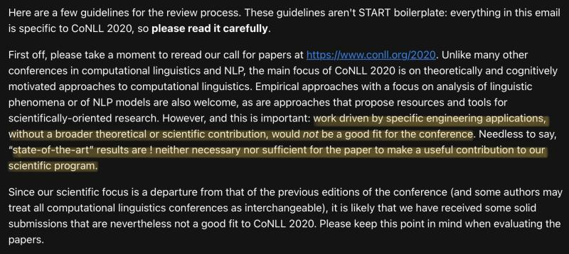

{fig-align="center"}

CoNLL 2020 reviewer instructions. The NLP field needs work pushing the envelope of scientific understanding, not just pursuing SOTA!

*Originally posted on [LinkedIn](https://www.linkedin.com/posts/benjaminhan_conll2020-nlp-activity-6695427445631303680-pdng).*
