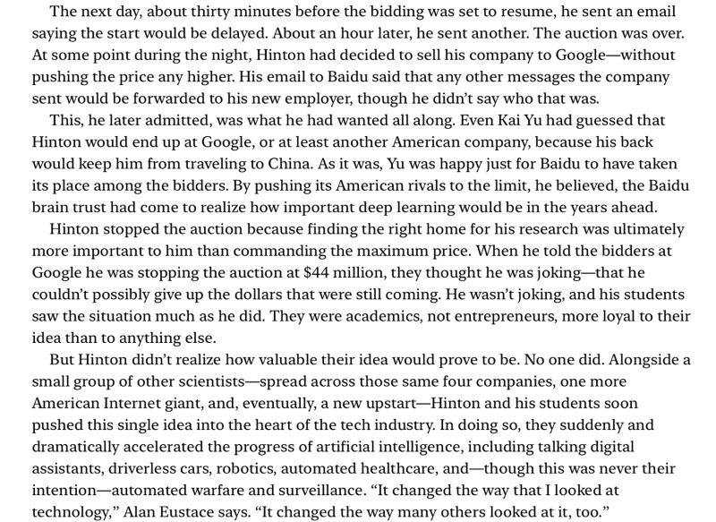

{fig-align="center"}

The moment when Hinton decided to sell his company to the highest bidder. The rest, is history.

Cade Metz. Genius Maker: The Mavericks Who Brought AI to Google, Facebook, and the World. 2021.

*Originally posted on [LinkedIn](https://www.linkedin.com/posts/benjaminhan_deeplearning-ai-history-activity-6779287024236163072-eUem).*
