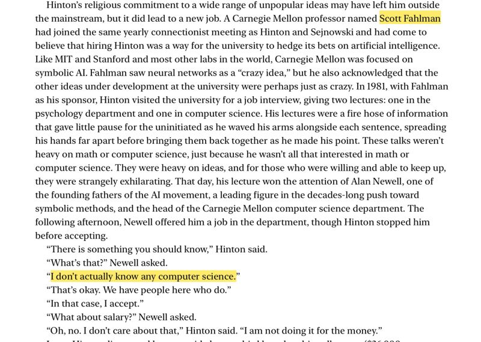

{fig-align="center"}

Fun tidbits from Cade Metz's book "Genius Maker":

* I didn't know Scott Fahlman was the sponsor for Hinton's job interview @ CMU!
* I wonder if the dialog between Newell and Hinton really happened as written. :-)

*Originally posted on [LinkedIn](https://www.linkedin.com/posts/benjaminhan_cmu-ai-deeplearning-activity-6780019934094344192-Ctj-).*
