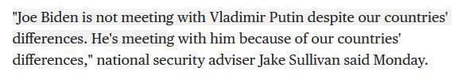

{fig-align="center"}

The fascinating complexity of natural language - consider the quote in the screenshot:

- Is Biden meeting with Putin?
- Does any difference exist between the two countries?
- Do the differences cause Biden to meet with Putin?
- Do the differences between two countries usually cause their leaders to meet?
- Does Biden's meeting with Putin deviate from the expectation?
- What is the expected mood of the meeting between Biden and Putin?
- Why is Biden meeting with Putin?
- Why did Sullivan give such a statement?

*Originally posted on [LinkedIn](https://www.linkedin.com/posts/benjaminhan_nlp-nli-reasoning-activity-6809989028314783744-o2GQ).*
