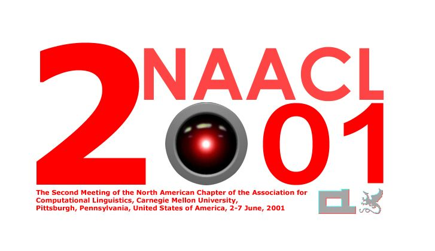
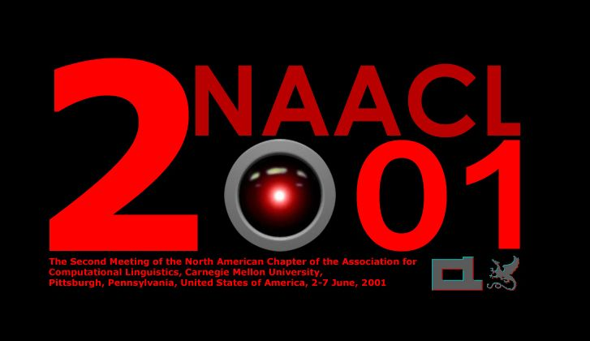
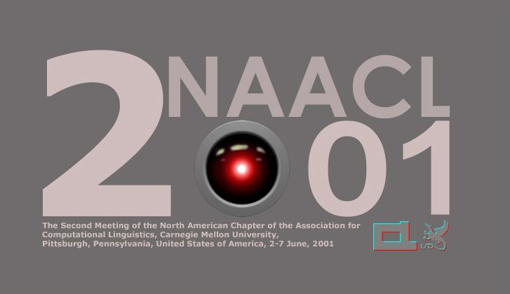

::: {layout-ncol=2}

:::

NAACL2021 just ended a week or so ago.

20 years ago, when NAACL 2001 was hosted by Carnegie Mellon University - School of Computer Science - Language Technologies Institute, the students held a T-shirt design competition, and I submitted mine. But alas, my design did not win. :-)

*Originally posted on [LinkedIn](https://www.linkedin.com/posts/benjaminhan_naacl2021-activity-6813343994521772032-Idmn).*
