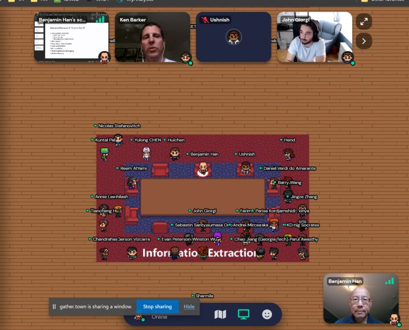

{fig-align="center"}

Just held a wonderful ACL2021 Birds of a Feather session on Information Extraction with many brilliant researchers! Tomorrow there is a follow-up BoF session on IE chaired by Ken Barker - don't miss it!

*Originally posted on [LinkedIn](https://www.linkedin.com/posts/benjaminhan_acl2021-nlp-informationextraction-activity-6828400080802992128-GnCU).*
