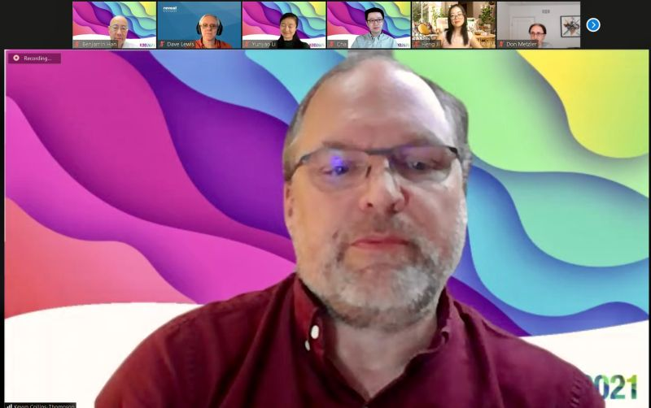
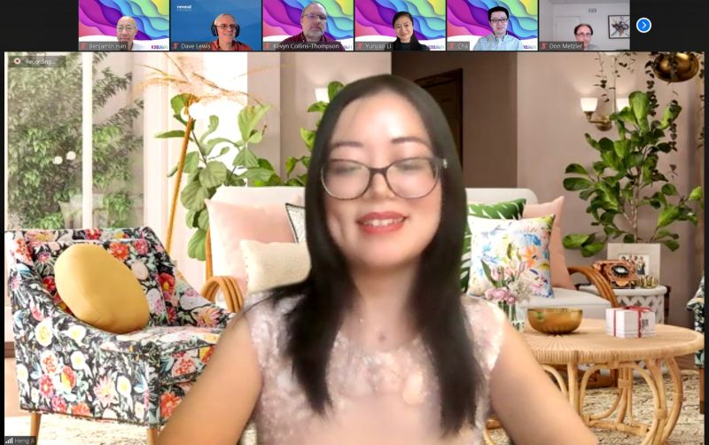
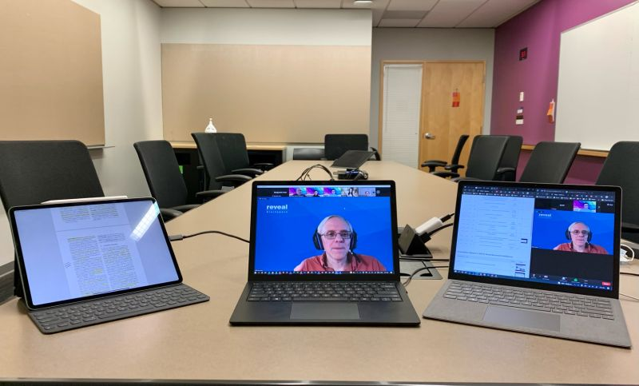

::: {layout-ncol=2}
.](cover.jpg)

:::
Wonderful panel today at Document Intelligence Workshop @ KDD2021!

Thank you for the wonderful presentations, talks, panel discussions and all the work to make this happen, my fellow workshop organizers and paper reviewers! Hopefully we'll see you next year!

Invited speakers (alphabetical): Kevyn Collins-Thompson, Heng Ji, Yunyao Li, Don Metzler, Benjamin Van Durme, Cha Zhang

Program committee (alphabetical): Doug Burdick, Dave Lewis, Yijuan Lu, Hamid Motahari, Sandeep Tata
Chair: Benjamin Han

Workshop website where recordings will be available: <https://document-intelligence.github.io/DI-2021/>

*Originally posted on [LinkedIn](https://www.linkedin.com/posts/benjaminhan_kdd2021-di2021-documentintelligence-activity-6832845655568977920-5w7Z).*
