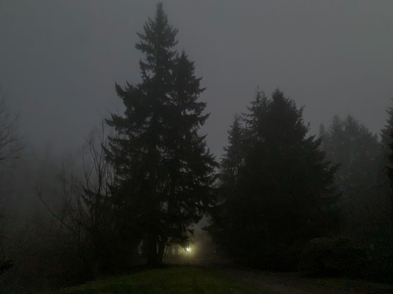

{fig-align="center"}

What is your guiding light when the world is turning gray?

(Photo @ my dusk run in the foggy Pacific North West today)

*Originally posted on [LinkedIn](https://www.linkedin.com/posts/benjaminhan_what-is-your-guiding-light-when-the-world-activity-6892282351318114304-GM_q).*
