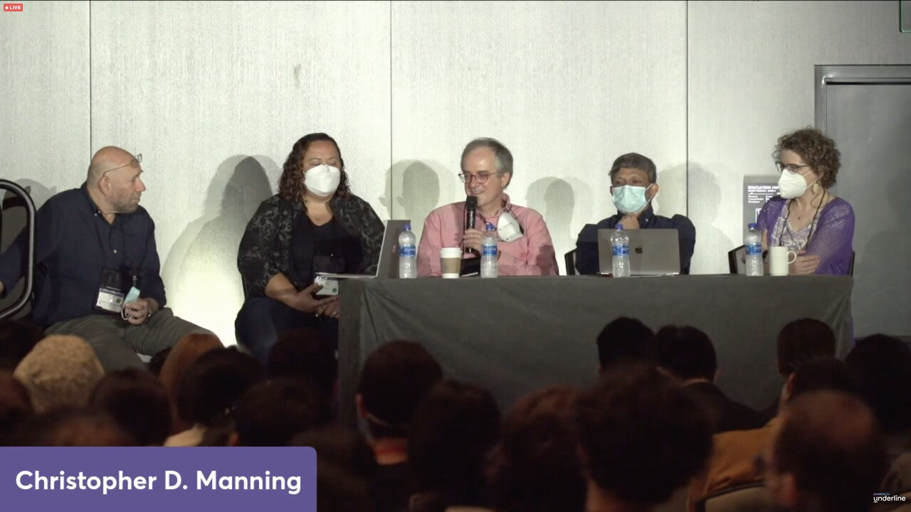

{fig-align="center"}

After hearing various observations/laments from faculty friends that NLP people these days are just applied math people who don't really know language, here is the wonderful NAACL2022 panel "The Place of Linguistics and Symbolic Structures" that just took place, given by Chitta Baral, Emily M. Bender, Dilek Hakkani-Tur, Christopher Manning, and moderated by Dan Roth.

(Totally with you on the importance of reasoning, Salim!)

*Originally posted on [LinkedIn](https://www.linkedin.com/posts/benjaminhan_naacl2022-nlgpu-conference-ugcPost-6952683519936507905-SjiN).*
