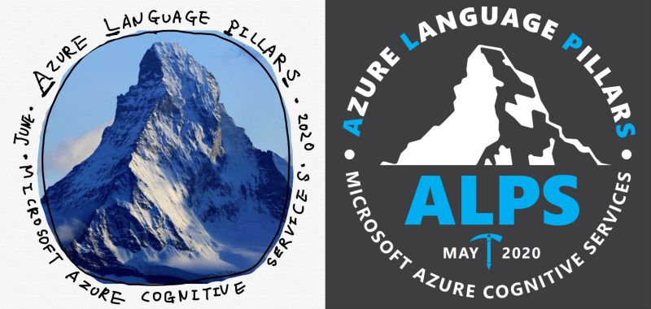
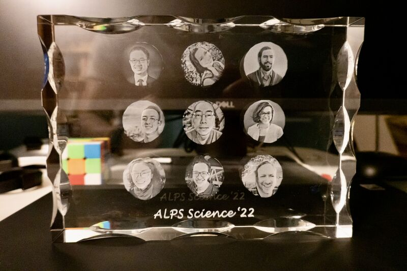

The coming Friday (9/9) marks my last day in Microsoft. The past 5.5 years has been an absolutely amazing ride: it's truly my privilege to have worked with so many talented colleagues and friends on so many challenging and impactful problems!

To all my friends in ALPS (Azure Language Pillars): keep firing on all cylinders and bringing the best NLGPU services to the world!

To all of my friends in Microsoft: thank you so much for your support and friendship. I'll always cherish the memory you have shared with me on this journey!

Picture 1: my initial hand-drawn design of the ALPS insignia and the final design by James Tee.

Picture 2: the best gift I ever received -- a plaque given to me by my team to memorialize our time together!

Stay tuned for my next adventure! :-)

*Originally posted on [LinkedIn](https://www.linkedin.com/posts/benjaminhan_microsoft-azure-nlgpu-activity-6972744261909843968-GJhK).*
