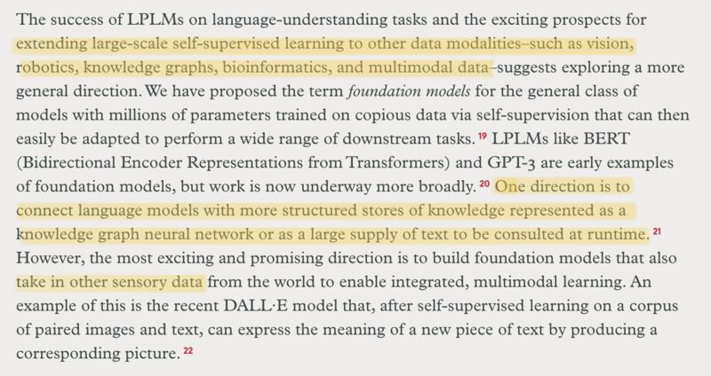

An excellent summary of the past and a look ahead on where NLU & reasoning will go next by Christopher Manning. Insightful points on comparing denotational semantics with distributional semantics and arguing learning from a set of "contexts" (instead of objects) *is* learning the meaning. Also in the highlights is predicting fusion of other modes of knowledge into foundation models as the next waypoint.

I'm actually *personally* a bit more optimistic about the democratization of giant foundation models. Just look at the recent examples of BLOOM and Stable Diffusion (not to mention huggingface). If Moore's Law continues, together with the advance in distributed training, the raw cost of training such models will be within reach of smaller entities. As the recent research illustrates, it's not about numbers of parameters, but rather about data (and knowledge).

---

Christopher Manning. 2022. "Human Language Understanding & Reasoning." American Academy of Arts & Sciences. Spring 2022. [[1]](#ref-1).

> The last decade has yielded dramatic and quite surprising breakthroughs in natural language processing through the use of simple artificial neural network computations, replicated on a very large scale and trained over exceedingly large amounts of data. The resulting pretrained language models, such as BERT and GPT-3, have provided a powerful universal language understanding and generation base, which can easily be adapted to many understanding, writing, and reasoning tasks. These models show the first inklings of a more general form of artificial intelligence, which may lead to powerful foundation models in domains of sensory experience beyond just language.

*Originally posted on [LinkedIn](https://www.linkedin.com/posts/benjaminhan_nlu-foundationmodels-stablediffusion-activity-6979853313374646272-hTvK).*

---

## References

[1] Christopher Manning. "Human Language Understanding & Reasoning." American Academy of Arts & Sciences, Spring 2022. <https://www.amacad.org/publication/human-language-understanding-reasoning>
