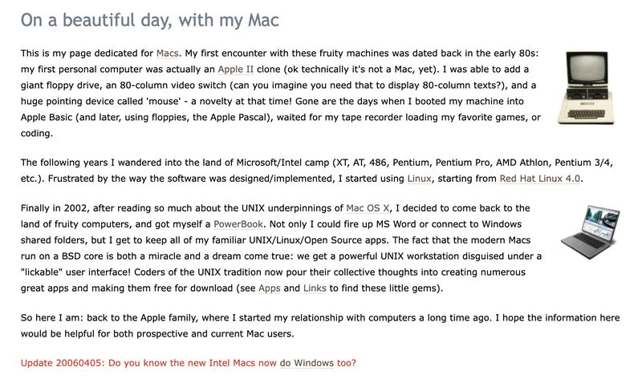
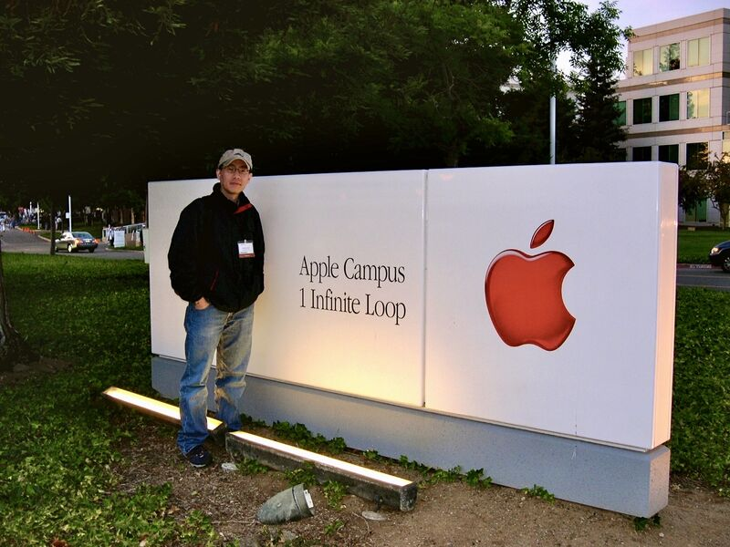
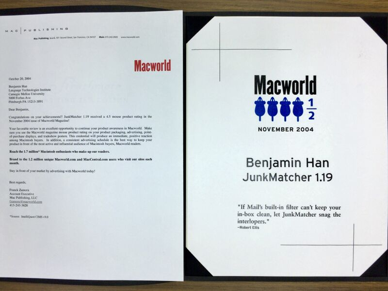

Sunday walking down the memory lane: my love letter to Macintosh almost 20 years ago, on my now frozen-in-time CMU website ([[1]](#ref-1)).

What I didn't say was that "the last straw" convincing me switching from Linux to Mac OSX was one day sitting in Dana Scott's class ([[2]](#ref-2)), watching him demonstrating in the beautiful Mathematica running on OS X. A few days later I became the owner of a beautiful Titanium PowerBook G4 ([[3]](#ref-3)).

A few years later I wrote a little opensource tool called JunkMatcher ([[4]](#ref-4); thanks Steve Caplin for the beautiful Dodo bird icon designs!), and got myself a free trip to WWDC 2004 and a 4.5-Mouse rating from Macworld magazine. Lots of fun hacking Mail.app (first AppleScript and then Objective-C)!

Also worth noting: I was the only one sporting a Mac when I joined IBM Research. I received lots of interesting comments on that back then. ;-)

*Originally posted on [LinkedIn](https://www.linkedin.com/posts/benjaminhan_macintosh-cmu-linux-activity-6982389357898846208-BDk-).*

---

## References

[1] Benjamin Han. "My Love Letter to Macintosh." CMU personal website. <http://www.cs.cmu.edu/~benhdj/Mac/index.html>

[2] "Dana Scott." Wikipedia. <https://en.wikipedia.org/wiki/Dana_Scott>

[3] "PowerBook G4." Wikipedia. <https://en.wikipedia.org/wiki/PowerBook_G4>

[4] Benjamin Han. "JunkMatcher." SourceForge. <https://junkmatcher.sourceforge.net/Home/index.html>
