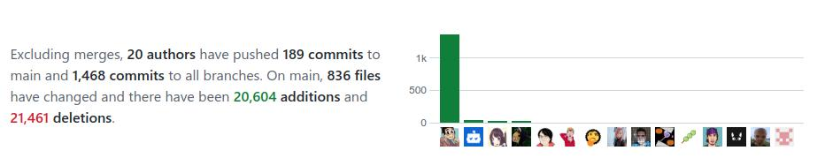

Giorgio Gilestro wrote an excellent guide for scientists to the world of Mastodon. [[1]](#ref-1) Hopefully Sigmoid.social (where I am) can be included in the list.

*Originally posted on [LinkedIn](https://www.linkedin.com/posts/benjaminhan_mastodon-an-introduction-for-beginners-and-activity-6995917336922787840-TKl_).*

## References

[1] Gilestro, Giorgio. "Mastodon: An Introduction for Beginners and for Scientists." <https://www.nature.com/articles/d41586-022-03668-7>
