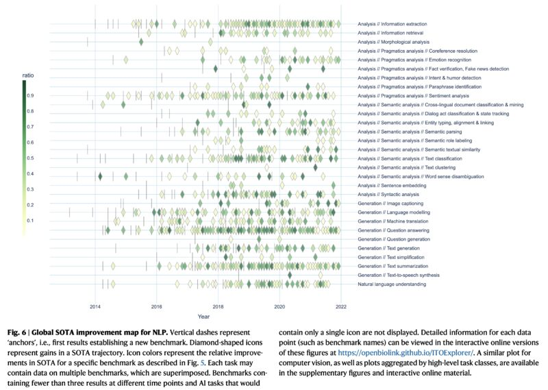

Which NLP / NLProc tasks are more saturated?

Simon Ott, Adriano Barbosa da Silva, Kathrin Blagec, Jan Brauner, and Matthias Samwald. 2022. "Mapping Global Dynamics of Benchmark Creation and Saturation in Artificial Intelligence." Nature Communications 13 (1): 1–11. [[1]](#ref-1)

*Originally posted on [LinkedIn](https://www.linkedin.com/posts/benjaminhan_nlp-nlproc-benchmark-activity-7000596075044634624-pdGO).*

---

## References

[1] Simon Ott, Adriano Barbosa da Silva, Kathrin Blagec, Jan Brauner, and Matthias Samwald. "Mapping Global Dynamics of Benchmark Creation and Saturation in Artificial Intelligence." *Nature Communications* 13 (1): 1–11, 2022. <https://www.nature.com/articles/s41467-022-34591-0>
