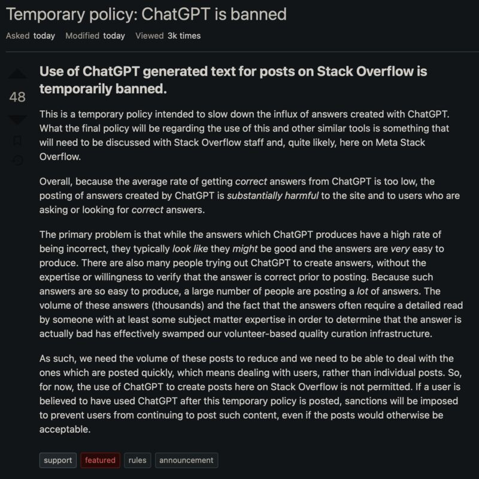

Amazing as ChatGPT is, it will bring many new challenges not just to discussion forums like StackOverflow, but also to education, recruiting, publishing, law, etc.

* ChatGPT is banned over StackOverflow because its average correct rate is too low: [[1]](#ref-1)

In a dystopian future, we may have machines write all the articles, machines read all the articles, and humans only get to write and read bullet points.

*Originally posted on [LinkedIn](https://www.linkedin.com/posts/benjaminhan_chatgpt-stackoverflow-education-activity-7005425096722960385-t6by).*

## References

[1] Stack Overflow Meta. "Temporary policy: ChatGPT is banned." <https://meta.stackoverflow.com/questions/421831/temporary-policy-chatgpt-is-banned>
