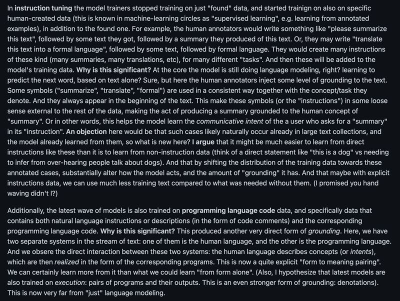
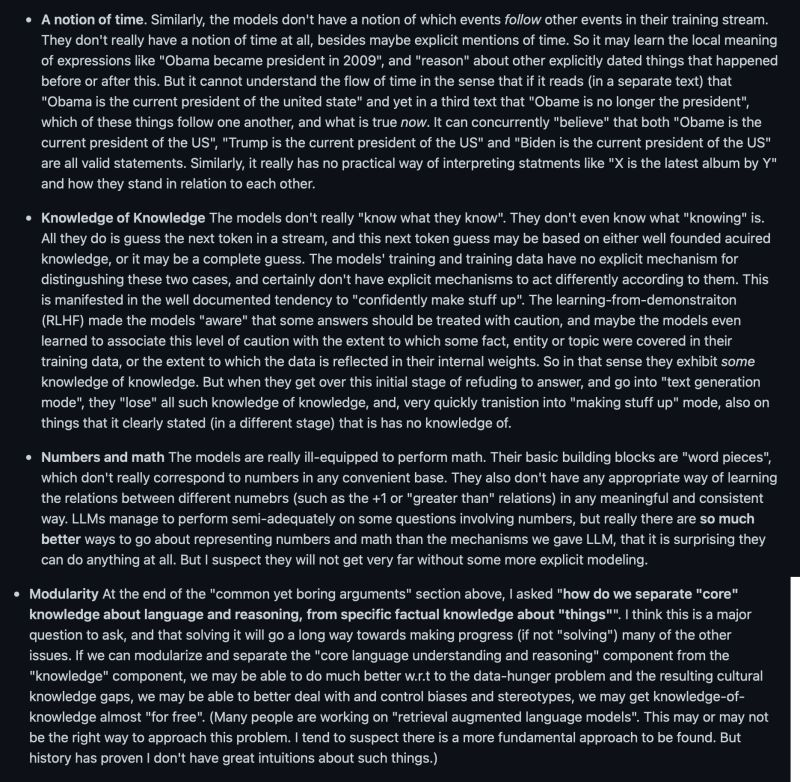

Very balanced and insightful take on LLMs, especially on ChatGPT, by Yoav Goldberg: [[1]](#ref-1)

I like a lot that Yoav pointed out ChatGPT is not your usual LLMs trained on just texts. It's trained with grounding information (Fig. 1).

As to the limitations Yoav listed, I'd argue some of them -- A notion of time, Knowledge of Knowledge, Numbers and math, and Modularity (Fig. 2) -- are very interrelated. I always feel training LLMs to do math with almost the same regime (i.e., training with lots of examples) is a fool's errand: other than the difficulty of making machine learn infinity from finite examples, why bother if a simple calculator can do a better job than LLMs? What we should do is to train our AI to use tools -- calculator, Newton's Laws of Physics, time calculus, basic logical reasoning -- just like what we humans do. It's all about Yoav's Modularity, which includes dedicated components for core language understanding and reasoning.

(X-post on [Mastodon](https://sigmoid.social/@BenjaminHan))

*Originally posted on [LinkedIn](https://www.linkedin.com/posts/benjaminhan_llms-chatgpt-reasoning-activity-7016123408799203328-2iJS).*

## References

[1] Yoav Goldberg. "Reflections on ChatGPT." <https://gist.github.com/yoavg/59d174608e92e845c8994ac2e234c8a9>
