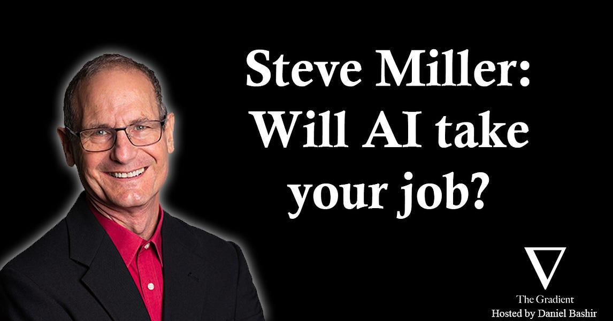

A wonderful podcast from The Gradient I listened to on my late-afternoon run along the Lake Union today: Daniel Bashir interviews Professor Steven Miller on the brave new world of AI and its impact to jobs. My key takes (thank you Siri dictation!):

- Augmentation is different from automation. We should strive for automating for the sake of augmentation ("bicycle for the mind").

- Comparing census 1940 to 2018, 60% of job titles are brand new.

- Personal note: Labor displacement may happen in targeted sectors (as always), but overall technologies will enable humanity to venture into new problem spaces, and the universe is infinite!

- Comparing to machine intelligence, humans excel at contextualization. My take: it may always be true until a real embodied AI emerges.

- Personal note: Model explanation is a MUST for the era of human-AI collaboration, even at the cost of accuracy. A lot of research in AI and HCI is needed.

- Organizational friction to adopt the latest tech may not be bad -- it provides necessary brakes before we fully understand their implication. Tech problem is ultimately a human problem.

*Originally posted on [LinkedIn](https://www.linkedin.com/posts/benjaminhan_steve-miller-will-ai-take-your-job-its-activity-7027158372575580160-HKwU).*
