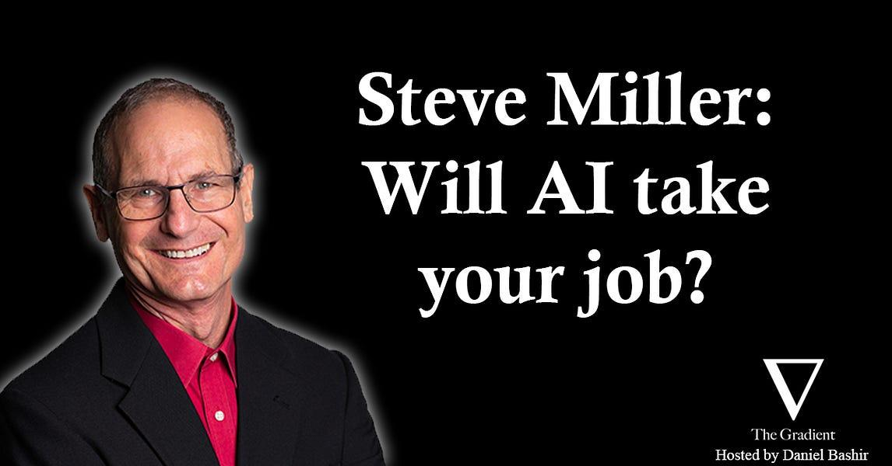

A wonderful [podcast from The Gradient](https://thegradientpub.substack.com/p/steve-miller-will-ai-take-your-job) I listened to on my late-afternoon run along the Lake Union today: host [Daniel Bashir](https://danielbashir.com/) interviews Professor [Steven Miller](https://accountancy.smu.edu.sg/faculty/profile/9608/Steven-MILLER) on the brave new world of AI and its impact to jobs. Steve is Professor Emeritus of Information Systems at [Singapore Management University](https://www.smu.edu.sg/), founding dean of the SMU School of Computing and Information Systems, and co-author with [Tom Davenport](https://www.tomdavenport.com/) of *[Working with AI](https://mitpress.mit.edu/9780262047241/working-with-ai/)* (MIT Press, 2022) — the 29 case studies referenced throughout the conversation.

**Key takeaways from the interview**:

- [**Augmentation is different from automation**](#ch-augmentation-vs-automation). We should strive for automating for the sake of augmentation ("bicycle for the mind").

- [**Comparing census 1940 to 2018, 60% of job titles are brand new**](#ch-real-world-difficulties).

- [**The labor question is about *what* work, not *how much***](#ch-real-world-difficulties). 11 of 12 largest economies project labor *shortages*, not surpluses. The real risk is failing to create new middle-income work as automation absorbs older work.

- [**Compared to machine intelligence, humans excel at contextualization**](#ch-human-machine-intelligence) — and the same strength injects *noise* into repetitive decisions. Algorithms outperform humans on consistency where consistency is what's wanted (Kahneman, Sibony & Sunstein, *Noise*).

- [**Organizational friction to adopt the latest tech may not be bad**](#ch-org-adoption) — it provides necessary brakes before we fully understand their implication. Complementary investments to make AI productive in an org are typically 4–10× the direct tech spend. Tech problem is ultimately a human problem.

- [**"Safe to speed"**](#ch-safe-to-speed). Better brakes let cars go faster. Responsible AI isn't the constraint on progress — it's what *enables* speed. Boeing's 737 MAX MCAS deployment is the cautionary counter-example: progress driven dangerously, not safely.

**My take:**

- Labor displacement may happen in targeted sectors (as always), but overall technologies will enable humanity to venture into new problem spaces, and the universe is infinite!

- Humans' contextualization advantage over machines may hold until a real embodied AI emerges.

- [Model explanation is a MUST for the era of human-AI collaboration, even at the cost of accuracy](#ch-tradeoffs). A lot of research in AI and HCI is needed.

::: {.callout-tip}
**Postscript (May 2026).** The displacement-vs-complement debate Steve sketches here resurfaced in finance-side form three years later: see [the Citrini Research / Citadel Securities 2028-crisis exchange](/posts/20260502-2028-intelligence-crisis/), where Citadel's rebuttal leans directly on Steve's "recursive capability does not imply recursive adoption" framing and on the same Microsoft-Office complement-not-replacement case the 29 *Working with AI* case studies documented.
:::

---

*Originally posted on [LinkedIn](https://www.linkedin.com/posts/benjaminhan_steve-miller-will-ai-take-your-job-its-activity-7027158372575580160-HKwU).*

## Episode chapters

Jump to the enriched transcript below. The episode is audio-only on Substack — there's no per-timestamp deep-link, so chapter timestamps are reference markers, not links.

- 0:00 — [Intro](#ch-intro)
- 2:40 — [Steve's evolution of interests in AI, time in academia and industry](#ch-evolution)
- 5:15 — [How different is this 'industrial revolution'?](#ch-different-revolution)
- 10:00 — [What new technologies enable, the human role in technology's impact on jobs](#ch-human-role)
- 11:35 — [Automation and augmentation, and integrating new technologies in the workplace](#ch-augmentation-vs-automation)
- 21:50 — [Difficulties of applying AI systems in real-world contexts](#ch-real-world-difficulties)
- 32:45 — [Re-calibrating human work with intelligent machines](#ch-recalibrating)
- 39:00 — [Human/machine intelligence and hybrid work](#ch-human-machine-intelligence)
- 47:00 — [Tradeoffs in using ML systems for automation/augmentation](#ch-tradeoffs)
- 52:40 — [Organizational adoption of AI and speed](#ch-org-adoption)
- 1:01:55 — [Technology adoption is more than just a technology problem](#ch-not-just-tech)
- 1:04:50 — [Progress narratives, "safe to speed"](#ch-safe-to-speed)
- 1:09:41 — [Outro](#ch-outro)

## Transcript

What's here is the [Gradient Podcast Episode 58](https://thegradientpub.substack.com/p/steve-miller-will-ai-take-your-job) audio, transcribed locally with [mlx-whisper](https://github.com/ml-explore/mlx-examples/tree/main/whisper) (`large-v3` model) and diarized with [pyannote.audio 3.1](https://github.com/pyannote/pyannote-audio), then reorganized into a reader-friendly form. The dialog itself is verbatim — no words added, cut, or reworded — but five layers of editorial structure have been added on top:

- **Chapter + topic outline.** 13 chapters from the Substack episode page (H3 headings), sliced into fine-grained topic subsections (H4 headings). The H4 titles are editorial summaries of what's being discussed, not verbatim speaker quotes. The full outline is in the right-hand sidebar.
- **Inline hyperlinks.** First mention of every salient acronym / concept / paper / book / person / company links to the most authoritative source.
- **Bracketed acronym expansions.** Where an acronym appears for the first time without being expanded in speech, the expansion is inserted in `[square brackets]` (e.g. `MCAS [Maneuvering Characteristics Augmentation System]`) to mark the addition as editorial.
- **Editor's notes** in blue callout boxes flag claims that are verifiable and slightly off, heuristics worth a sanity-check, or unsourced numbers.
- **Numbered references.** Books and formal works cited in the body have a `[[N]](#ref-N)` cite linking to the References block at the bottom of the post.

Punctuation, capitalization, and paragraph breaks are editorial. Speaker labels (`**Daniel Bashir:**` / `**Steve Miller:**`) come from pyannote's two-speaker diarization, which assigns each Whisper segment to whichever turn has the largest temporal overlap. ASR mishearings of proper nouns the transcription model mangled are corrected with visible inline `[[fix: original → corrected]]` markers so the edit is auditable rather than silent.

### 0:00 — Intro {#ch-intro}

#### Daniel's standing intro and framing for the episode

**Daniel Bashir:** Hi everyone, and welcome back to another episode of [the Gradient Podcast](https://thegradientpub.substack.com/). We interview various people who research, build, use, or think about AI, including academics, engineers, artists, entrepreneurs, and more.

I am your host, Daniel [[fix: Beshear → Bashir]], and today's guest is Professor [Steve Miller](https://accountancy.smu.edu.sg/faculty/profile/9608/Steven-MILLER). Steve is a Professor Emeritus of Information Systems at [Singapore Management University](https://www.smu.edu.sg/).

Steve served as founding dean for the SMU School of Computing and Information Systems and initially established and developed the technology core of the school's research and project capabilities in cybersecurity, data management and analytics, intelligence systems and decision analytics, and software and cyber-physical systems, as well as the management science-oriented capability in information systems and management.

Steve works closely with a number of Singapore government ministries and agencies and companies via steering committees, 

advisory boards, and advisory appointments. This was a pretty different conversation from the usual on this podcast, looking more at questions of how the development of AI systems is going to affect the world of work.

I think it's really valuable and important to consider some of these questions from a high-level perspective. I think that being within the AI world can often become a kind of bubble, and it's a good idea to step back a bit and think about some of these broader questions.

I really enjoyed this conversation with Steve, and I think there are a lot of useful insights that you'll take away from this episode.

As always, if you aren't already subscribed to The Gradient, go ahead and follow us wherever you're listening to this podcast. You can also follow us on Substack, where you'll get notifications whenever we release a new podcast episode, article, or newsletter. And now, without further ado, Steve Miller.

Steve, we have previously worked together on a fantastic essay you wrote for us at The Gradient on the impacts of automation on artificial intelligence. And the place I'd like to start is how your interests evolved towards thinking about some of these problems.

### 2:40 — Steve's evolution of interests in AI, time in academia and industry {#ch-evolution}

#### From a 1980s CMU PhD on factory automation to four decades following the same questions

**Steve Miller:** Briefly speaking, Daniel, when I was a PhD student at [Carnegie Mellon](https://en.wikipedia.org/wiki/Carnegie_Mellon_University) in the late 70s and early 80s — that's 1970s and 80s, by the way — I did my doctorate in an unusual CMU department in the engineering school called [engineering and public policy](https://www.cmu.edu/epp/). And I looked at applications of what was at that time, the first generation of automation that was controlled by general purpose computers. 

All right, because that's what was happening new at that time, and the early stages of sensor-based robotics, and focusing on impacts on factory productivity, labor requirements, and trade-offs between flexibility and efficiency, and how the new generation of automation, à la the early 1980s and that new wave of robotics, impacted what was called the flexibility-efficiency trade-off. So there we are. Take that as 1982, 1983.

40 years later, I've spent the entire arc of my professional career, both in industry for 13 years as a practitioner — this is all post-PhD — as well as the remaining years, university affiliated.

And I've looked at how automation and information, and today let's use the new buzzwords, digital technology, change the way we work and create new possibilities for things we can do. So I've always been attentive to that and have kept following it, with the culmination… and, you know, the book I just co-authored with [Tom Davenport](https://www.tomdavenport.com/) on [*Working with AI*](https://mitpress.mit.edu/9780262047241/working-with-ai/) [[1]](#ref-1).

**Daniel Bashir:** It seems like there's this interesting, maybe not dichotomy, but definitely a difference. Whenever we come along a striking advance in technology, something that seems truly exponential, where some people are like, this is the time when humans are no longer going to have jobs.

And there's another group of people who are like, we have said this every other time this kind of thing has happened in human history. And this seems to be the case with every so-called industrial revolution, every time that we see a change in technology we're surprised by.

And so having looked at this yourself over a couple of decades, the way in which new advances in technology have impacted things like efficiency, flexibility, do you feel like the debates, the questions we are trying to answer right now, do they look very similar to what they looked like a few decades ago? Do you notice any important differences?

### 5:15 — How different is this 'industrial revolution'? {#ch-different-revolution}

#### "Same same but different" — labor-displacement anxiety goes back to 1500s knitting machines

**Steve Miller:** It's important. In fact, Daniel, this topic goes back, at least in a documented sense, to at least 1500, in the 1500s, when [the Queen and the UK denied some patents for knitting machines](https://en.wikipedia.org/wiki/William_Lee_(inventor)) out of concern of labor displacement.

::: {.callout-note}
**Editor's note.** The reference is to William Lee's stocking-frame knitting machine, invented circa 1589. Tradition has it that Queen Elizabeth I refused him a patent on the grounds that it would put hand-knitters out of work. The often-quoted line attributed to her ("Consider thou what the invention could do to my poor subjects…") is a later rendering, and the historicity of the specific exchange is uncertain — but the patent denial itself, and the anti-displacement reasoning, are well-documented.
:::

And, you know, then, of course, it's gone through there. I, a few things. It's important that these questions keep resurfacing. And there's a funny expression that's a Singaporean local way of using English of "[same same but different](https://en.wikipedia.org/wiki/Same_same_but_different)." And it exactly captures the essence that some structural aspects are the same and these arguments keep replaying.

But the world does change. New issues do come up. It's not just new technology, but new technology in particular does new kinds of things to different extents at different scales with different economics.

And none of these issues of what's going to happen with labor displacement, transitions, labor force impacts, it's not inherently the technology.

It is dominated by choices made in the deployment.

#### Choices in deployment, not technology, drive labor outcomes

And we'll get into that in the automation versus augmentation discussion. So it is a very familiar argument. In fact, knowing that, some very well-informed people have said, yes, we know this is a very familiar argument. We know that even with all of the massive increases in technology and concordant uses of technology for automation and increasing advanced ways of augmentation, we still have kept on growing the size of the workforce.

But don't we come to a time when it will be different, right? Where that future past pattern won't predict.

And it's important that people raise the question, but it's not as if the answer is known and some people are better at predicting the outcome than others. Although, of course, that's always true. But people who are super knowledgeable about this make the point that the future can be chosen relative employment opportunities or just overall opportunities and whether the technology is used to create or take away opportunities.

It's not an inherent aspect of the technology itself. They're institutional issues as well as private sector issues. So it's a never ending thing. But we are in a space where we can do things with technology to a greater degree that we've never been able to do before. So we shouldn't be alarmist, but let's just say there are real transitional issues together in a double helix type of way with new kinds of possibilities.

And the thing is to view these things in a double helix kind of way, that it's this yin-yang opposites coexisting, never seeming to go away of both the threat and transitional issues with the possibility issues.

And it's not either or, it's the simultaneity that's sort of hard to get a grip on.

**Daniel Bashir:** I think you're right. And I guess there are two main points I would distill out of what you just said. There was a lot of really good stuff there.

The first was I loved that "same same but different" way of putting things. I think that there's a sense in which if you look at the changes in technology, certainly the fundamental laws by which a lot of things operate is — are going to be the same.

I think [Ben Thompson](https://stratechery.com/about/) has a really great example of this in the way that he articulates [internet economics](https://stratechery.com/aggregation-theory/), where he talks about how we are now at a point where a lot of things literally become zero marginal cost or as close to literal as possible.

### 10:00 — What new technologies enable, the human role in technology's impact on jobs {#ch-human-role}

#### Why "the technology will take jobs" misattributes agency

**Daniel Bashir:** And that's not really an economic situation, I think, that we encountered in a meaningful way at this type of scale before. And so just the fact that, well, we have these overall economic principles that are the same, but the places we land on the graphs are going to end up different because of what new technologies enable is, as you pointed out, something that is really striking, is really different from before.

The second one, I guess, is about this later section on the narratives we tell ourselves. I think that the way you articulated it, that we tell ourselves, well, technology is going to do this. It is going to take jobs. That's assigning it a sort of autonomy that I think, in many ways, as you're pointing out, rests with us as well.

And I feel like it's almost a similar mistake to when people assign agency to AI systems, for instance. 

It's kind of overblowing what the technology is going to do on its own without recognizing that, hey, we humans are also building this thing. It's going to interact with us fundamentally.

### 11:35 — Automation and augmentation, and integrating new technologies in the workplace {#ch-augmentation-vs-automation}

#### The 29 *Working with AI* case studies — every one was augmentation, not automation

**Steve Miller:** So let's come to the theme of automation and augmentation. I'm not going to say "versus." I'm going to explain why I say "and."

And as you know, Daniel, I just published this co-authored book with the prominent co-author Tom Davenport, who for decades has been writing about trends in corporate IT and going back to the 80s, and then analytics, and then into AI. And it was a beautiful experience to be able to sort of work under the tutelage of Tom because he's such a master in story crafting.

And we did these 29 case studies. And we purposely chose successful deployments of AI-enabled solutions in a wide range of real-world work settings.

Nothing could be R&D. Nothing could be trial. 

Everything sort of had to be real, everyday work at that level. 

And they were all examples of augmentation. 

All right. A wide range. So one point to take away from that is there's more opportunities for augmentation. And I'm going to explain what I mean by augmentation versus automation in a moment. Then people realize we don't always have to default to the only alternative is full automation.

#### Definitions: automation drives wages down, augmentation drives output (and eventually wages) up

So let me come back to a stylized way in which labor economists and economists of technological change define automation and augmentation in a generalized way. Use of the word automation for when the deployment of the technology results in the person being made redundant. All right.

So an augmentation where the deployment is such that certain tasks or subtasks are automated, but the person is not made redundant. And in fact, the technology is used to complement and to increase the output and productive capability of the person.

So in the case of automation, the people doing that kind of work, their wages are driven down. In the case of augmentation, the people doing that kind of work, their output is driven up. And over time, hopefully, and usually the trend is their wages are driven up as well.

All right. Although there might be a lag there because in a sense they're contributing more.

Automation obviously creates job opportunities for the tenders, the designers, the people in the outer loops, if you will. But in the direct sense of the people doing that job, it drives down the wages. So the book had a lot of rich examples of augmentation. You hear a lot about displacement. You don't see a lot of case studies about complementarity.

Now, this is not to say that there are not examples of using automation and using increasingly capable automation via AI enablement for displacement. Obviously, you're going to have that. But it's to say there's more examples of augmentation than people realize.

#### Why augmentation works: the model can be good, not perfect — humans handle the long tail

Now, one of the big questions is, is that an intermediate stepping stone and holding point? Or is that going to be a persisting situation. And one of the reasons augmentation works so well is you just have more interplay in the sense that the technology can be good, but it doesn't need to be perfect.

And the combination of the person with the oversight, doing the adaptation, dealing with some of the error situations, you just have a lot, you can deal with a lot more and you can deal with contingencies.

And as any of you who build [ML](https://en.wikipedia.org/wiki/Machine_learning) [machine learning] models know, you can get them pretty reasonable in a not so long period of time. But that last 10%, that last 5%, that last 3% actually can be extraordinarily difficult, if not prohibitively expensive, and maybe not just worth it. And of course, when you have high transaction rates, a 10% or 7% error rate, 

you're dealing with these items all the time, right? So I have views on which we're going to see both. We're going to see some of the examples we had in the book, I predict, will stay as augmentation. Some will move beyond. And as the system gets better and the totality of the work experience gets more finely tuned, because it's never just the AI system, it's the surrounding process, higher degrees of automation will come in.

But what I think will happen, Daniel, is here's the thing most people don't fully appreciate. Even though with computers, 

increasingly more capable software, everything we can do with the marvels of modern machine learning makes our automation more adaptable…

Certainly compared to the way controls were done in software through logic, both with information systems and physical automation systems 10 years ago, 20, 30 years ago.

There's still a boundary that you're designing it.

And you can, with more capable, adaptive sensing, all of that, you can deal with a wider envelope of uncertainty, but the world just has this way of changing beyond your convenient little envelope of uncertainty. So there's always, always — and it's never going to go away — be that aspect of work where the nature of the adaptation, the nature of the pivoting, the nature of the changing, the nature of the need to explore, experiment, just goes beyond what the automation systems are designed for.

#### The double helix: stable regimes want automation, unstable regimes want augmentation

And automation systems really work best in not perfect environments, but relatively more stable, predictable environments where you need to scale, get consistency, repeatability, reliability. And economically, it's not A or B. You need both. You need those regimes of relative stability where I need to turn out the transactions more consistently, more productively, lower cost, where we want the automation.

But if that's all you're doing you'll never make the big changes, you're only transitioning the new things — and I don't mean just in the R&D lab, I mean in the production and operational parts of the company it's too — they're always doing things that are less familiar.

So there's always this sort of, you know, I think of it as a double helix or, you know, like a [Möbius strip](https://en.wikipedia.org/wiki/M%C3%B6bius_strip) or a yin-yang thing between the simultaneous need for adaptability and for efficiency and productivity.

So that has implications for where we can fully automate and where we're going to use the AI-enabled tools for augmentation and support and enhancement.

And it's never going to go all one way or the other. We're going to retain with that simultaneity.

#### Distribution shift, in ML terms

**Daniel Bashir:** The adaptability component of what you just said is really important.

And connecting this to another conversation I had, if I can make this less understandable, 

is I think putting it in a way ML people might be familiar or used to thinking about it. When I spoke to [Zachary Lipton](https://www.zacharylipton.com/), this professor at CMU, he often speaks about, again, the ideas of things like [distribution shift](https://en.wikipedia.org/wiki/Domain_adaptation).

So in kind of reintroducing this idea for listeners, in ML models, there are often assumptions that need to be made about where the data that you trained on comes from. And you often assume that the data you test on, the data in the quote real world, comes from the same place.

And Lipton often says that this is kind of just like, well, if you imagine this process over time, it's like your theoretical model is basically God decided to drop your data out of the sky on day one, and God decided to drop data in the exact same way on day two. And that's not at all how the real world works.

**Steve Miller:** No, exactly. And interestingly enough, there are regimes of economic activities where I want to buffer from changes in the environment.

You know, I've got this product, I've got this service. People want it in a predictable, reliable way. And I want it steady, steady, steady, right? And everything I want to do is to keep variation out of it, right? Which is a fabulous way to use automation to enhance consistency.

And while that part of the sort of economic revenue cycle is going, there's the simultaneous part that I want to do something that's different than what anyone else is doing. I want to do it in a different way. I want to do it in a way where we don't have prior data on. The customer doesn't have prior experience on. You know what I mean? How do you run the big ML in that kind of world? You don't.

So in that kind of thing, you'll use AI-based tools to help with experimentation, exploration, collaboration. But it's going to be a while before you can grow into the familiarity and be able to stabilize sort of a way of working where we can tune up the automation.

So the key thing is implied in the word of automation is doing what we're familiar with. It means doing today's work and yesterday's work, right? And that's important, but it's sort obvious that if that were always the case, we wouldn't be where we are in 2022, approaching 2023, relative to 1960, 1970, 1980. Somehow a lot of things, new things, new products, new services, new ways have to come in.

So yes, the technology will increasingly be used to automate, but automation is of the familiar and what you're trying to stabilize in a way and sort of milk the money out of and eventually it will wind down — but it's much harder to drive that automation in the less familiar. And every one of you just think about your everyday working experience and — you know, I don't mean sort of like the most deep esoteric research labs. I mean, sort of the everyday regular ways of work.

### 21:50 — Difficulties of applying AI systems in real-world contexts {#ch-real-world-difficulties}

#### Familiar work vs. new work in your everyday job

**Steve Miller:** Some things are familiar, steady, keep the variation out. And some things we're trying to figure it out.

You know, we're pivoting, we're changing, we're adapting, we're experimenting.

#### The Autor study: 60% of 2018 jobs were in titles that didn't exist in 1940

And that type of work, interestingly enough, tends to be very labor intensive. And just so the audience understands, I admire greatly the work of some of the economics of technology economists like [Erik Brynjolfsson](https://digitaleconomy.stanford.edu/people/erik-brynjolfsson/) [[fix: Eric → Erik]] and [David Autor](https://economics.mit.edu/people/faculty/david-h-autor) [[fix: Alter → Autor]] at MIT and [Daron Acemoglu](https://economics.mit.edu/people/faculty/daron-acemoglu) [[fix: Darren Asimoglu → Daron Acemoglu]] at MIT. And there's, of course, many others, and they do fabulous work.

David Autor and a team of people from several other institutions, they looked at the employment in the U.S. in 1940. It was about 50 million people.

They took what they had at the time of their analysis was over the last two or three years, and U.S. employment data as of the end of 2018.

And it was 161 million people.

So in that 78 years, 1940 to 2018, you can just imagine everything that happened in the realm of technology. I mean, it was the age of the transistor, the age of the computer, the age of software and, you know, the age of the Internet. And you have it all there. Right. And yet employment increased from 50 million to 161 million.

Now, they did this thing, which was an estimate. 

And admittedly, it's an imperfect estimate because it's something that's impossible to know precisely. And their ability to do this estimate would have been impossible without modern natural language technology support for doing economic analysis, interestingly enough, because they looked at job titles from the census every few years, starting 1940, 50, 60, you know, all the way to 2010 and the latest data from 2018. And they looked at patent data and a whole bunch of other things.

And they made an estimate of that 161 million in the newer contemporary era. What fraction of it was in job titles that to the best that they could surmise, you know, the best analysis they could do, were job titles that existed in 1940 — versus what fraction of that total employment was in job titles that had been added to the census since 1940.

Now, remember, if there's only like nine of something in the country, it doesn't get added to the census. Something has to be prevalent enough where it shows up enough on enough radar screens where it gets added to the census.

And what they estimated is about 60% of the total amount of work in 2018 was in precise job titles that did not exist in 1940.

::: {.callout-note}
**Editor's note.** The figure traces to David Autor, Caroline Chin, Anna Salomons, and Bryan Seegmiller, ["New Frontiers: The Origins and Content of New Work, 1940–2018"](https://economics.mit.edu/sites/default/files/inline-files/Autor%2C%20Chin%2C%20Salomons%2C%20Seegmiller%202022.pdf) [[2]](#ref-2) (NBER WP 30389, Sept 2022; later QJE 2024). The headline summary is that "roughly 60 percent of employment in 2018 is found in job titles that did not exist in 1940" — Steve's number is on point.
:::

#### Labor shortage, not labor surplus, is the looming demographic problem

**Daniel Bashir:** Wow.

**Steve Miller:** So the point there is the importance of new work. Let me restate that again, the importance of new work. And when we talk about automation, we're almost always talking about existing, prior, somewhat more familiar, therefore older work. So we'll get the automation, you know, we'll use the technology for automation. That doesn't worry me.

The issue is, do we maintain the momentum of creating new types of work, new types of jobs, you know, and some obvious types of things. Creating ML solutions itself is its own little ecosystem of doing that.

New energy installation for solar or for battery systems or electric charging infrastructure is related to that. What's going on in pharma? Not all new work, by the way, is technology-driven. Some of it's services, right? Some of it's driven by taste, preferences, demographics, things like that. But the technology-driven new work tends to be higher skill, higher wage.

The things that, okay, now we have people who will paint nails or do tattoos or even like a [Grab](https://www.grab.com/) driver, it's new work. Some of it's not technology-enabled. Some of it is — like the [Uber](https://www.uber.com/) driver. Here we call it Grab, but it tends to be lower wage.

And in a nutshell, what — not all but some — very knowledgeable labor economists believe is that the issue is not going to be the number of jobs. In fact, as you see in the U.S. now, there's a shortage of people.

In 11 of the 12 largest economies in the world, because of demographics, the high proportion of the growth of older people at a faster rate than the growth of younger people, there's projected labor shortages in 11 of the 12 of the world's largest economies going out.

::: {.callout-note}
**Editor's note.** The "11 of 12 largest economies" framing is a heuristic Steve cites repeatedly across his work; the underlying source is typically [UN World Population Prospects](https://population.un.org/wpp/) projections combined with national labor-force participation trends. The exact ratio depends on which economies you include and the projection horizon — directionally true for 2030 and beyond, less crisp than the round number suggests.
:::

So labor shortage isn't the issue. It's the quality of the jobs. And of course, we're going to have the high-end jobs and the high-skilled jobs. Undoubtedly, we have, we will, but they'll continue. But will there be enough of those middle-income jobs? Will even the jobs on the lower end of the wages be sustainable and okay enough for people to live.

And all of those issues, when you state it like that, that's not a function of machine learning algorithms. It's a function of how people choose to deploy them and what they use to do.

And whether they're going to put focus on just automating the existing jobs and the jobs of yesterday and driving labor out. Or even if you do that, recouping that labor to move them back into your ecosystem to say, well, how do I do the new thing? How do I figure out to more efficiently install solar panels or put up electric charging stations or the thousand other ways that create new work.

So we're not going to have a disappearance of work. It's the distribution of work, the need to create new work, and the way to do it in ways that creates opportunity and value for people.

#### "Fourth industrial revolution" and the question of cognitive automation

**Daniel Bashir:** There are a lot of different questions that I think each independently we could spend a lot of time on wrapped up in some of what you just said. And perhaps we'll use this opportunity to hone in on one of them.

I think one of the reasons that people feel the more recent developments, what some call the [quote unquote fourth industrial revolution](https://en.wikipedia.org/wiki/Fourth_Industrial_Revolution), what feels so different about it is what has always put humans, set humans apart from other animals, for instance, is this quality of our intelligence. There's something truly unique about it.

And if we were to someday automate to achieve that in machines in some meaningful way, the question starts to revolve around, well, does everything humans do become redundant? And I think not for all sorts of reasons, but that's perhaps a devil's advocate way I would go about making that argument.

The notion of, well, what do people do versus machines do? And the need to recalibrate to that truly does go back to the 1500s and the 1800s and 1900s and the 2000s, because we've had machines that do things that we've never been able to do before with machines.

**Steve Miller:** And, you know, you might or might not like the word cognitive automation, but, you know, here we are with data-driven machine learning, where some have astutely made the observation that even though we've had very high degrees of automation in the past, a limiting factor was you needed to be able to codify the rules explicitly. And that was time intensive and expensive and economically put some constraints on what was viable to automate.

And what has happened, of course, with ML, there's a lot of sophistication. This community would know it very well.

But what you need to codify has moved to a much higher level of abstraction because now you codify the nature of the [neural network](https://en.wikipedia.org/wiki/Neural_network_(machine_learning)) and how you do your architecture and parameter tuning, and the actual rules by which the machine has to figure out how to make predictions doesn't have to be explicitly codified, right? It's implicitly occurring through the nature of the data analysis.

### 32:45 — Re-calibrating human work with intelligent machines {#ch-recalibrating}

#### "I thought that's what was special about us" — humans as tool-builders, now in the cognitive space

**Daniel Bashir:** Well, whoa, that really changes things.

**Steve Miller:** It really does. So, on one hand, as you said, it's like, well, I thought that's what was special about us.

And it is shocking in that way. But keep in mind, another level of abstraction that's always been true about us, our species, and we go back a long way, is we've been innovative tool users and tool developers.

And here we are. I mean, the nature of the tools that we can use and develop are beyond what has ever been imagined.

We've always had these tools in the physical space, like a jet airplane, but we have them in the so-called cognitive space because of the ability to have data-driven ML, basically. You know, because we've always had logic-driven ML, but you had the constraint that you had to know how to generate the logic.

So it does change our boundaries of, well, what are we vis-à-vis machines? But on the same hand, we're fabulous tool builders. And it means we as a society can actually solve problems, take on things, create vaccines rapidly, create a new energy source, move from here to there, you know, in ways that literally would have been impossible before.

So without these new abilities to use new tools in new ways, the prospects for surviving as a species is not so positive. So we need this ability.

So that's what's so interesting. It's the simultaneity of, well, the threat of displacement of the familiar versus the ability to create the new and unfamiliar, which is definitely the pathway to survival and going forward. And they're both coming from sort of the same thing, this new AI-enabled capability that, frankly, is pervading everything, if you will, you know, super general purpose.

#### Responsible AI: deploy productivity, but don't use it solely for displacement

So it's one of the great navigational issues of our time. That's why I think it's so exciting to be alive. And to me, responsible usage of AI means deploying it, getting it out there, using it to drive productivity, but not using that productivity solely for displacement. And to the extent that it makes sense to have some displacement, recouping that to move it into the innovation aspects.

I mean, you're not going to take up — you're not going to take an operations person doing information work or physical work and, you know, turn them into a computer scientist. I'm not sort of being unrealistic like that, but anytime you're trying some new process, you just need a lot of people around at a lot of levels.

Some or many who are quite close to the work.

And they don't have to be your scientist types, just because a lot of things have to happen to try and deliver a service in a new way, be it in healthcare or energy or supply chain.

So there are transitional issues, but I don't see it as a zero-sum game.

You know, I don't see we're consuming the opportunities for human work. It's more of a transition issue and a deployment issue. But that's not to minimize that some of the people who bear the brunt of transitions are not going to be the same people who bear the benefit of the new opportunities.

### 39:00 — Human/machine intelligence and hybrid work {#ch-human-machine-intelligence}

#### Humans are great at contextualizing — and that same strength injects noise

**Daniel Bashir:** That makes sense to me. Before we get into more detail on organizational adoption of automated systems, one connected question to this that you spent some time thinking about is the nature of human and machine intelligence and what the implications of that are for human-machine hybrid efforts for automation. Could you tell me a little bit about your thinking on those fronts?

**Steve Miller:** Yeah. I tell you, my thinking is really evolving because of the frontier is changing so much. And as you alluded to before, the notion of, well, what's the role in what the human versus the machine? We've got to reset some of our assumptions.

And here's sort of the dilemma on that. Not dilemma in a bad way, but something that requires human-like wisdom to manage.

What humans are fabulous at is sensing context, tacit context, organizational context, unstated, implicit needs, and filling in gaps like that, especially in new and unfamiliar situations.

So you can see all kinds of ways where, of course, we have these wonderful models. They're trained within a certain distribution. Has that distribution shifted? When it has, how do we deal with it? Even if we don't know that it's shifted, how are we monitoring it along the way just in case? And when we find something that just sort of doesn't make sense, or even if it makes sense by the model, it's not what we want to happen, how do we deal with it?

So you need people for that. And it's labor intensive. So people are great at contextualizing and dealing with exceptions. What a fabulous strength that most humans have.

Now, the other problem is people are great at contextualizing and dealing with exceptions. So there's famous so many studies like in the criminal justice system where a judge will take the same kind of case and even on different days of the week, give somewhat of a different judgment. And even greater degrees of variation is judges who are supposed to be identically trained take essentially the same kind of case or an identical evidence base and rule differently.

A lot of these examples are explained in that book by [Daniel Kahneman](https://en.wikipedia.org/wiki/Daniel_Kahneman) [[fix: Danny → Daniel]], [Olivier Sibony](https://www.oliviersibony.com/) [[fix: Oliver Sibonyi → Olivier Sibony]], and [Cass Sunstein](https://hls.harvard.edu/faculty/cass-r-sunstein/) called [*Noise*](https://www.hachettebookgroup.com/titles/daniel-kahneman/noise/9780316451406/) [[3]](#ref-3), which I cannot recommend strongly enough.

Everybody doing the ML work, who's the gradient community, and even if you're beyond the gradient community, this is a must read.

It's not like the newest theory on the block. These folks working on this book have been doing this work for decades. And it reflects the craftsmanship and insight of decades of distillation.

But getting down to distilling sort of a thick book, noise in the way they define it is variability of a type that you don't want to be there.

#### Where you want consistency vs. where you want variability

When you're doing creative brainstorming sessions and certain facets of work and certain facets of your life, you want all kinds of unexpected variability. But when you're applying for a mortgage or when you go in to have the doctor look at your sore throat or, you know, you have a parking violation or, you know, you have to go to the justice system in some ways…

you'd like to see a certain consistency. We'd all like to see a certain consistency in here are the facts of the case. Here's what the judgment should be.

And what they show is that humans, for all the wonderful things that they do with reading context and contextualizing and seeing the special nature of each situation, that for certain kinds of decisions that especially are more repetitive like decisions, but not only repetitive decisions, inject noise into the process. Noise being defined here as undesirable types of variation.

So we have the ability to contextualize things and to customize, often to great and important effect. and we have the simultaneous ability when we're working in a certain kind of transactional mode and we all work, you know, different parts of our work, certain aspects of transactional mode to inject noise into the process in ways that would be better off if they're not there.

#### Algorithms (even simple ones) outperform humans on consistency

And they review the evidence that any kind of algorithm will perform more consistently than a human in certain kinds of decision tasks.

Doesn't have to be an ML thing. It could be a simple rule and then simple equal-weight regressions, which aren't always the most accurate answer, but actually they're very robust against changes in data distributions.

And then more finely tuned regressions.

And then, of course, ML takes it even to a higher level of consistency and accuracy. So this notion, and it comes back to this automation–augmentation thing.

When do we want to automate the decision process for stability and consistency? And when do we want the individualized, contextualized nature where we know we're injecting noise and variability, but that's okay.

And they describe some processes where, like you dimensionalize things, you evaluate them on each dimension, you have people do that independently, then you bring it together and have the social discussions to sort of figure out how to put people's ideas together. So how to combine that human capability with a certain kind of consistency, which undoubtedly machines, including algorithmic-based decision making — doesn't even have to be ML algorithms — help us do.

This is a new age. I mean, the problem's not new. There's variants of this that go back decades, but it's now, we've never had it at this scale before. So the notion of putting machines and humans together in the workplace couldn't be more interesting, couldn't be more exciting. And how do we achieve the balance that we need?

And of course, the balance will be very contextualized and it will be evolutionary as a work unit or a process is sort of evolving. This is a kind of intelligence that we need humans to map out and to know where and how we use our machines so that we can get people to work competitively, to create value so we can pay them well.

**Daniel Bashir:** I think what you're saying really connects to a lot of ways in which people think about, as you said, the appropriateness of automation.

There was a lot of discourse, I think, before the public understanding shifted that said, well, I plug an algorithm, an ML algorithm into a situation, and it's just going to get rid of the bias we humans have, which is not at all true. But there are certainly benefits to consistency, to just pure accuracy in certain contexts.

**Steve Miller:** Well, even if it's not accurate, consistent, you know what I mean?

**Daniel Bashir:** Yes. Exactly.

And I think that there's a set of trade-offs here that really have to be considered when we're deciding where to automate, how to automate, when to augment, what the relative strengths are.

For example, there was this article out of [Stanford's Human-Centered Artificial Intelligence Institute](https://hai.stanford.edu/) some time back that was looking at this question of how much should we care about [interpretability](https://en.wikipedia.org/wiki/Explainable_artificial_intelligence) in deploying AI systems in particular situations.

And I think that in certain areas of discourse, this has become almost fetishized to the point where we need our systems to be interpretable no matter what. That is kind of the highest, most important thing we can look at.

### 47:00 — Tradeoffs in using ML systems for automation/augmentation {#ch-tradeoffs}

#### Interpretability vs. accuracy — and the danger of "so-so automation"

**Daniel Bashir:** And yes, it is important. 

It is a valuable thing to have. But if you know that in all the relevant ways, your system is consistent, it performs better than humans in terms of making more — money, more accurate judgments — in the particular context where you want to deploy it that may not be true in other contexts, then I think the interpretability aspect starts to matter a little bit less.

And there was a doctor making this sort of argument that even in the realm of healthcare, which you would consider pretty high stakes, you could make a version of this argument, which I think was more nuanced than what I just said, but important.

**Steve Miller:** As the ML people know, you can always get interpretability — ML has never lacked interpretability. Only certain types of ML lack higher degrees of interpretability, but those parts tend to have higher degrees of predictive accuracy. So there's this trade-off and people are working on it.

And that's exactly the interesting thing that with these wide range of AI tools — I'm not going to just say ML because ML is getting combined essentially with almost every area of AI — but with the wide range of AI tools combined with other aspects of digital processes, there's more trade-offs to make about how we use them in the process of how we're using them, how do we even know if an exception comes up, a special case comes up?

We understand what quality control is. We understand what plan, do, 

study, act is. That's the old classical [Deming cycle](https://en.wikipedia.org/wiki/PDCA). And it hasn't gone away. It's a fundamental part of organizational learning, human learning, and machine learning for that matter. But executing that with our more complex and nuanced set of tools, and therefore in these more complicated and evolving environments — whoa, new territory. You know what I mean?

So these are the exciting things, and they create opportunities for people who aren't just like computer scientists, because you've got to be on the ground. You need to be close to the work. You need to be domain specialists. Often these are hands-on operational people, hands-on either in the information side or the physical side. So these things can create opportunities for a wide range of people.

But you need employers who are inspired and progressive enough to say, this is what I'm going to figure out — versus I'm going to just take the most familiar types of work I have and automate what already is and stop there.

Because if we go that way, and that's the famous example of the expression that's so wonderful, ["so-so automation"](https://www.nber.org/papers/w25682) — sort of good enough to justify labor displacement, but you don't push it far enough to get the productivity-induced benefits of other value creation, then we get the worst outcomes.

::: {.callout-note}
**Editor's note.** "So-so automation" is Daron Acemoglu and Pascual Restrepo's term, introduced in ["The Wrong Kind of AI? Artificial Intelligence and the Future of Labour Demand"](https://www.nber.org/papers/w25682) [[4]](#ref-4) (NBER WP 25682, 2019; Cambridge Journal of Regions, Economy and Society 13(1), 2020). It denotes automation that is just productive enough to displace labor but not productive enough to generate offsetting demand for new tasks.
:::

So in my view, there's no way to not go ahead with using the technology.

And the worst of all worlds, in some ways, is to use it timidly and in a lazy fashion to just do the familiar existing work without putting the efforts into the sort of figuring out all the new ways of combining humans and machines, new ways of working.

But that's more taxing. You know, it takes more effort. You sort of need more switched-on people. And sure, in these bigger companies with a lot of bright folks, you know, people gravitate to that. But in these small enterprises and small and medium and they're just, you know, they don't do fancy stuff. They just do the basics. How do you get them to in their sort of world that's appropriate for what they do to move in that direction as well?

### 52:40 — Organizational adoption of AI and speed {#ch-org-adoption}

#### The fast/slow contrast: research progress vs. organizational change

**Daniel Bashir:** I think this might be a good point to talk about those aspects of organizational adoption in a little bit more detail. And so in your book and your article with us, one of the important things you've pointed out is the difference in speed in terms of AI advancement and adoption. And I think that certainly shows in the differences, for example, between consumer and enterprise adoption of AI systems. 

Like I can sit on my computer, open up [ChatGPT](https://openai.com/blog/chatgpt) and say, like, wow, this is already automating a bunch of things that I would do in my daily life. And certainly it can do quite a lot. But there is a big difference between me sitting at home on my computer using this and then figuring out how you integrate systems like that into an organization. And you see this in some of these book case studies of why they keep humans in the loop.

**Steve Miller:** But so take the natural language example that you just did with ChatGPT, and you can get such amazing answers that are so confident — whether or not they're right. But meanwhile, let's say you work for some brand that people are familiar with. I don't want to mention some commercial product or software product or industrial product or consumer product.

And you have to create content that goes out there that thousands or millions of people engage with.

You're going to be darn careful about the tone of what that stuff says, what it says exactly. Okay, you might use some of these tools to generate some early material, but it's not like, 

so who cares if it's right or not? There are some consumer stuff that really does have that sense to some extent, just as a commercial reality. But there are many aspects of commercial things you get out there. You're doing the safety manual for a car, right? You're going to be really careful about what that stuff is. So things are going to move slower.

#### Healthcare and finance: training a model is fast, changing the standard of care takes years

So I have this fast–slow contrast, the rate at which we see the stories on The Gradient about new developments and the people you interview and what's coming out of, you know, choose amongst [OpenAI](https://openai.com/), [

Google](https://research.google/), [Microsoft](https://www.microsoft.com/en-us/research/), [Meta](https://ai.meta.com/), R&D, and other companies and all these university groups. Boom, so fast.

And yet, changes in processes within organizations go step by step by step, and there's the bureaucracy and the funding and the approvals. And you begin to realize as frustrating as that can be, it's not all bad. And it's got some inherent controls built into it. And it paces things. And it's why labor displacement doesn't happen nearly at the speed that people think it will.

And I also looked at some applications in depth in financial services, banking, and especially in healthcare recently. Whoa, the ability to train an algorithm on a data set can happen quickly. The ability to convince nurses, doctors, specialists, that there should be a change in what they call the standard of care takes years. Years. And is that always a bad thing? No.

Sometimes we wish it's faster, of course, but people are naturally skeptical and I want to see the evidence. I don't care what your theoretical algorithmic evidence is. I want to see the evidence in our clinical process. And indeed, things move very slowly and not just in health, obviously in all kinds of organizations.

So the good news for that is even with all its frustrations, especially if you're in a company and I wish we could move faster, it puts a certain prudence into the nature of change, which is good to see, actually.

#### Business prediction is end-to-end; ML prediction is micro

**Daniel Bashir:** I think some of what you just said speaks to this wide gap in the discourse and modes of thinking between people who are knee-deep in the technology, the AI world, and just people going about their daily lives working in organizations.

**Steve Miller:** Right. They're in the big gap because if you're knee deep in the latest ML and other related aspects of AI development and ML, [RL](https://en.wikipedia.org/wiki/Reinforcement_learning) [reinforcement learning], you know, interactions and we see the announcements all the time, it's like we can do such amazing stuff.

But to do it in a reliable way, trusted way, trusted so that other people in the organization are trusted, so that the legal staff trust it, so that — remember, business — talk about an irony, business is like really into predictability.

ML people are all into making predictions, but they have a much more narrow sense of prediction. Their prediction is this very micro thing. Business wants to know, am I going to be liable? What's going to happen? Do I know how my end-to-end process is going to work? Do I know how my interactions with my counterparties and customers is going to work?

And that takes — you can figure it out, but it just takes testing. Testing, evidence, adaptation in itself, it's a sort of data science kind of thing, but it's a longer cycle data science kind of thing. It's the same principle of I have a goal, I try and do something, I get feedback, I measure the gap.

But that identical learning cycle, which is key to developing an ML algorithm, get your head around how that plays out with a company with 100 people or 1000 people or 10,000 people, and how you sort of have to abstract that organizational learning…

to go through that same plan, do, study, act thing, which is the inherent nature of intelligence.

And so that's why it's so good for ML people to hang out with domain users who fret about things that as an ML designer, like you can't imagine why you should ever fret about, but that's what the domain user cares about.

And similarly, it's got to work in both directions. There are new things we can do with the tech that domain users won't ever think of because they don't know what the tech can do. So we need that hybridization. But even getting that hybridization within a work environment takes time.

You know, you got to sit in on extra meetings and that takes away from your everyday work, some job rotation, some subcontents, some extra work. But it helps with this hybridization and bridging the domain, including the business aspects.

And business can be for-profit, not-for-profit, regulated, unregulated, and sort of the technology possibilities.

Even that kind of discovery is very time intensive.

#### Complementary investments are 4–10× the direct technology spend

And it's an exciting way for employees to get engaged in the modern workplace. So it's the other side of, well, somebody's doing the same transaction work every single day, unchanging, and boom, we're going to put in [robot process automation](https://en.wikipedia.org/wiki/Robotic_process_automation) [RPA] or some simple ML thing and displace this person.

Some of that will happen, but usually these are huge change management efforts. And fortunately, change management is very labor intensive — sort of fun, a little frustrating, but it's very labor intensive, even though it leads to higher productive ways of working.

But let's put it this way. There have been a wide range of reliable estimates that show to make what people call the complementary investments, the supporting investments, to actually get increases in the ability to improve how you do things, can be four times to 10 times — four times to 10 times — the actual effort that you spend on the direct technology.

::: {.callout-note}
**Editor's note.** The 4–10× figure traces to Erik Brynjolfsson, Lorin Hitt, and Shinkyu Yang's work on intangible/organizational capital and IT (e.g., ["Intangible Assets: Computers and Organizational Capital"](https://www.brookings.edu/wp-content/uploads/2002/01/2002a_bpea_brynjolfsson.pdf), Brookings Papers, 2002), later popularized in Brynjolfsson and McAfee's writing. The specific multiplier varies by study and sector — directionally well-supported, less crisp than "4 to 10 times" suggests.
:::

Because of this whole set of concentric circles of alignment and process changes and coordination and all that kind of stuff. So that's why that world moves much slower.

**Daniel Bashir:** It's easy to say that technology is a bubble, but I think it's difficult to contend with what that really means and to account for it. And I think a lot of what you just said ties into this, the technologist needs to understand that the work of getting this stuff to work in the real world to actually getting people on board with using it.

### 1:01:55 — Technology adoption is more than just a technology problem {#ch-not-just-tech}

#### Convincing people to change is itself a kind of intelligence

**Steve Miller:** It's not just a technology problem. It is interpersonal. It is political. There are so many things that are going on. We could get to 90% accuracy in some kind of prediction and drive down the cost of doing that, you know, using platforms and all this stuff. You still have to have the intelligence to convince somebody in some other department that this is a good thing to do.

And as a result of doing it, what are going to be the implications for how other aspects of the workflow are going to change?

And how are we going to address that?

So you're just thinking of the improvement of that model with the predictive accuracy. And this other person is thinking, oh, you just created a lot of extra work for me.

Granted, it's beneficial, but I got to figure out how to take in all this sort of extra stuff I need to do to transition this stuff in. We forget that convincing people to make change is a type of intelligence.

We forget that when somebody tells you there's a new way to use this predictive model, what's everything required that has to wrap around that to make that a reliable organizational process I can build my business on?

That's a very special type of intelligence. These are things far outside the realms of what we can use ML for, although ML can support subparts of it. You know what I mean?

So is the nature of human work going away? Not at all.

But it's changing.

#### "Progress at all costs" is an extreme version of the discourse

**Daniel Bashir:** I think one way to respond to what you just said, and not a way I'd advocate, is a lot of these structures, this bureaucracy, is hampering the development of technology. It is hampering progress. And I, the person building this technology, I'm doing a good thing. Progress is good. And so we should get rid of all of these structures and, you know, put people in charge who think like me, who are also technologists who think that this kind of progress needs to happen at all costs. And this is a very extreme version of some of the discourse I do see.

Yes. And I do think that there is something good to that [Steve Jobs](https://en.wikipedia.org/wiki/Steve_Jobs) notion of the world doesn't have to be the way it was laid out in front of you. That you can make meaningful change and people should feel empowered to do that. 

But I do think that the logical end point of we need progress at all costs does not land us in a good place.

**Steve Miller:** Yeah. Let me use an expression that's easy to remember. And I think a lot of your listeners can connect to it. And the simple phrase is "safe to speed."

In the early days of the automobile, before they had brakes, or when brakes were so rudimentary as to not work very effectively, given the fact that we now had a motorized vehicle, right? — very crude ways of braking. Crash and burn, people died, and all of that.

But what happened was better brakes were created. Ironically, better brakes let people go faster.

### 1:04:50 — Progress narratives, "safe to speed" {#ch-safe-to-speed}

#### Better brakes let cars go faster — the conceptual metaphor

**Steve Miller:** All right, that's a conceptual metaphor, but there's something to that. You know, we need the appropriate support infrastructure and the braking, as in the auto brakes, so that we can move faster.

#### Boeing 737 MAX MCAS as a counter-example: progress driven dangerously

Now, I just watched a fabulous Netflix documentary on what happened with [Boeing](https://www.boeing.com/) and the [737](https://en.wikipedia.org/wiki/Boeing_737_MAX) and [MCAS](https://en.wikipedia.org/wiki/Maneuvering_Characteristics_Augmentation_System) [Maneuvering Characteristics Augmentation System].

::: {.callout-note}
**Editor's note.** Steve is referring to [*Downfall: The Case Against Boeing*](https://www.netflix.com/title/81272421) (Netflix, 2022), directed by Rory Kennedy.
:::

And whether or not you take issue with that Netflix documentary, it had a particular slant, which I frankly agreed with, but, you know, I'm no expert in the matter. When that first Indonesian [Lion Air](https://en.wikipedia.org/wiki/Lion_Air_Flight_610) plane crashed, they did not even know the MCAS was in there. 

Because Boeing was so resolute that we're going to put in this new sophisticated software and we're going to avoid the regulatory need to put thousands of pilots through retraining. And we're going to sneak it in there and create a story where no new training is required.

And literally, the Indonesian airline did not even know this was — the first crash there. You know, then there was the second one with the [Ethiopian airline](https://en.wikipedia.org/wiki/Ethiopian_Airlines_Flight_302) where they knew it was in there and they followed the given protocols and it still cracked.

::: {.callout-note}
**Editor's note.** Lion Air Flight 610 crashed on October 29, 2018; Ethiopian Airlines Flight 302 crashed on March 10, 2019. Both were Boeing 737 MAX 8 aircraft, both were caused by MCAS malfunctions, and together they killed 346 people. The U.S. FAA grounded the 737 MAX globally on March 13, 2019.
:::

So there's one where they drove progress, but they did it in a dangerous way.

So, you know, there's lots of examples of driving progress in safer, responsible ways.

#### Autonomous vehicles, responsible AI, and not relying on UBI

Some people, I won't name names, who let's just get those [autonomous vehicles](https://en.wikipedia.org/wiki/Self-driving_car) on the road. And, you know, we have crashes and people die. Well, you know, people are going to die anyway. It's just, you know, for the greater good. I don't think sort of help build the public trust in how we go about this.

So let me just, as an ending, [responsible AI](https://en.wikipedia.org/wiki/AI_safety) is this whole approach to how we move forward. And the notion of the subpart of bias that social discrimination obviously is an issue, but it's actually just one of many, many, many issues on the broader issue of responsible AI.

How do I use AI to create new work, not just replace the existing work? Because frankly, we need to do both, right? Because you need the economic efficiencies and you need to redeploy the people or not use people for certain things that are the grunt work so we can move into new services and whatnot.

The nature of how we manage change is an entire people issue.

Down to the level of individual teams, teams of teams, their organizational units, the whole companies, industries, institutions, you know what I mean? 

So the whole human race, we're in this change management game, if you will, and how we choose to make use of these new technologies.

So it's a fabulously exciting time. Some people will benefit greatly. And how do we do it so a larger fraction of people feel they're the beneficiaries of all this fantastic new capability versus they're pushed aside? And that fundamentally is a human issue.

And I don't think the answer is [universal basic income](https://en.wikipedia.org/wiki/Universal_basic_income). I think it's the way we work. That's why it's so important these issues be worked out in every organization, small, medium, large, public sector, private sector, people sector.

**Daniel Bashir:** I think that's a perfect message for us to close out on. So, Steve, thank you for articulating that. I think that this is a really important set of questions for people both in the AI sphere, but also working in technology or frankly, anything more broadly to be thinking about. And I really appreciate your work, both the work you've done with us at The Gradient as well as your other writing.

And I want to thank you for doing all of that and for spending the time to talk with me today.

**Steve Miller:** Keep up that wonderful work with The Gradient and the fact that a small team does what they do and you serve the public interest and you guys do the fantastic articles and podcasts. It gives a ray of hope and it just shows there is a better side to our human nature.

And thank you for all the work you guys support.

### 1:09:41 — Outro {#ch-outro}

**Daniel Bashir:** And that is a wrap, my friends.

As I mentioned at the start of the episode, you can subscribe to The Gradient on Substack to receive not just this podcast, but also our articles and newsletters directly to your email.

You can also visit us at [thegradient.pub](https://thegradient.pub/), where you'll find all of that, as well as more information about The Gradient and how you could even contribute if you're interested.

And finally, if you enjoyed this episode, we would really appreciate your feedback.

If you'd like to leave a comment or review, we'd love to know how we can make this series more interesting and informative to you.

And with all that, I'll leave you until the next episode.

---

## References

**Podcast and transcript**

- [The Gradient Podcast Episode 58: Steve Miller: Will AI Take Your Job? It's Not So Simple](https://thegradientpub.substack.com/p/steve-miller-will-ai-take-your-job) (1:10:24, Feb 2, 2023)
- [The Gradient](https://thegradient.pub/) — the publication
- Transcript built locally with [mlx-whisper](https://github.com/ml-explore/mlx-examples/tree/main/whisper) (`large-v3`) from the Substack audio, with speaker turns from [pyannote.audio 3.1](https://github.com/pyannote/pyannote-audio)

**People**

- [Steve Miller](https://accountancy.smu.edu.sg/faculty/profile/9608/Steven-MILLER) — Professor Emeritus of Information Systems at SMU; the guest
- [Daniel Bashir](https://danielbashir.com/) — host of The Gradient Podcast
- [Tom Davenport](https://www.tomdavenport.com/) — *Working with AI* co-author
- [Erik Brynjolfsson](https://digitaleconomy.stanford.edu/people/erik-brynjolfsson/) — Stanford economist on technology and labor
- [David Autor](https://economics.mit.edu/people/faculty/david-h-autor) — MIT labor economist
- [Daron Acemoglu](https://economics.mit.edu/people/faculty/daron-acemoglu) — MIT economist; 2024 Nobel laureate
- [Daniel Kahneman](https://en.wikipedia.org/wiki/Daniel_Kahneman) — *Noise* co-author; 2002 Nobel laureate in economics
- [Olivier Sibony](https://www.oliviersibony.com/) — *Noise* co-author
- [Cass Sunstein](https://hls.harvard.edu/faculty/cass-r-sunstein/) — *Noise* co-author; Harvard law
- [Zachary Lipton](https://www.zacharylipton.com/) — CMU professor cited on distribution shift
- [Ben Thompson](https://stratechery.com/about/) — author of Stratechery; cited on internet economics
- [Steve Jobs](https://en.wikipedia.org/wiki/Steve_Jobs) — referenced for his "the world doesn't have to be the way it was laid out" attitude

**Companies and products**

- [OpenAI](https://openai.com/) — [ChatGPT](https://openai.com/blog/chatgpt)
- [Google Research](https://research.google/), [Microsoft Research](https://www.microsoft.com/en-us/research/), [Meta AI](https://ai.meta.com/) — research labs Steve groups together
- [Boeing](https://www.boeing.com/) — 737 MAX manufacturer
- [Grab](https://www.grab.com/) and [Uber](https://www.uber.com/) — gig-economy ride-hailing platforms cited as new (lower-wage) work
- [Carnegie Mellon University](https://en.wikipedia.org/wiki/Carnegie_Mellon_University) — Steve's PhD institution; CMU Engineering and Public Policy
- [Singapore Management University](https://www.smu.edu.sg/) — Steve's home institution
- [Stanford HAI](https://hai.stanford.edu/) — Stanford Human-Centered AI Institute
- [MIT Press](https://mitpress.mit.edu/9780262047241/working-with-ai/) — *Working with AI* publisher

**Background concepts**

- [Machine learning](https://en.wikipedia.org/wiki/Machine_learning) and [neural networks](https://en.wikipedia.org/wiki/Neural_network_(machine_learning))
- [Reinforcement learning](https://en.wikipedia.org/wiki/Reinforcement_learning)
- [Distribution shift / domain adaptation](https://en.wikipedia.org/wiki/Domain_adaptation)
- [Explainable AI / interpretability](https://en.wikipedia.org/wiki/Explainable_artificial_intelligence)
- [Aggregation Theory (Ben Thompson)](https://stratechery.com/aggregation-theory/) — internet economics framing referenced by Daniel
- ["So-so automation" (Acemoglu & Restrepo)](https://www.nber.org/papers/w25682) — productivity-displacement trade-off
- [Möbius strip](https://en.wikipedia.org/wiki/M%C3%B6bius_strip) — Steve's metaphor for the augmentation/automation duality
- ["Same same but different"](https://en.wikipedia.org/wiki/Same_same_but_different) — Singaporean idiom Steve uses for recurring labor-displacement debates
- [Robotic process automation (RPA)](https://en.wikipedia.org/wiki/Robotic_process_automation)
- [PDCA / Deming cycle](https://en.wikipedia.org/wiki/PDCA) — "plan, do, study, act"
- [Universal basic income](https://en.wikipedia.org/wiki/Universal_basic_income)
- [Fourth Industrial Revolution](https://en.wikipedia.org/wiki/Fourth_Industrial_Revolution)
- [Responsible AI / AI safety](https://en.wikipedia.org/wiki/AI_safety)
- [William Lee and the 1589 stocking-frame patent denial](https://en.wikipedia.org/wiki/William_Lee_(inventor))
- [Boeing 737 MAX](https://en.wikipedia.org/wiki/Boeing_737_MAX) and [MCAS](https://en.wikipedia.org/wiki/Maneuvering_Characteristics_Augmentation_System); [Lion Air Flight 610](https://en.wikipedia.org/wiki/Lion_Air_Flight_610) and [Ethiopian Airlines Flight 302](https://en.wikipedia.org/wiki/Ethiopian_Airlines_Flight_302)

**Books and papers**

1. Davenport, Thomas H., and Steven M. Miller. *Working with AI: Real Stories of Human-Machine Collaboration*. MIT Press, 2022. <https://mitpress.mit.edu/9780262047241/working-with-ai/> (the 29 case studies referenced throughout the interview)
2. Autor, David, Caroline Chin, Anna Salomons, and Bryan Seegmiller. "New Frontiers: The Origins and Content of New Work, 1940–2018." NBER Working Paper 30389, September 2022; later *Quarterly Journal of Economics* 139(3), 2024. <https://www.nber.org/papers/w30389> (source for the "60% of 2018 employment is in job titles that didn't exist in 1940" figure)
3. Kahneman, Daniel, Olivier Sibony, and Cass R. Sunstein. *Noise: A Flaw in Human Judgment*. Little, Brown Spark, 2021. <https://www.hachettebookgroup.com/titles/daniel-kahneman/noise/9780316451406/>
4. Acemoglu, Daron, and Pascual Restrepo. "The Wrong Kind of AI? Artificial Intelligence and the Future of Labour Demand." NBER Working Paper 25682, March 2019; later *Cambridge Journal of Regions, Economy and Society* 13(1), 2020. <https://www.nber.org/papers/w25682> (origin of the "so-so automation" term)

