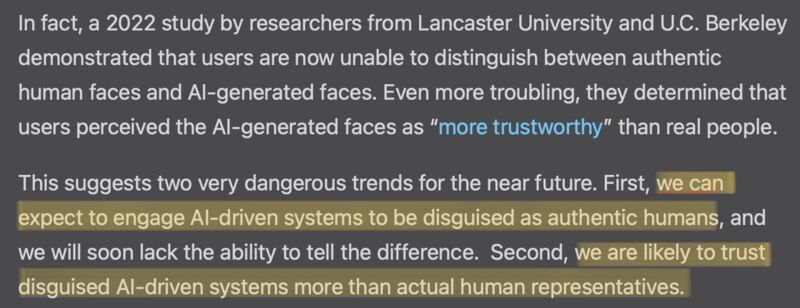

A prescient article written by Louis Rosenberg discussed an important topic three days before the debut of the conversational Bing: what could a convincingly human-like chatbot do to human psyche?

- Louis Rosenberg. The profound danger of conversational AI. Feb 4, 2023. [[1]](#ref-1)

For the researchers/engineers/designers: how do we design a chatbot to avoid such harm and manipulation? Other than always striving for providing unbiased and truthful answers, shouldn't we de-anthropomorphize it as much as possible for information-seeking use cases?

*Originally posted on [LinkedIn](https://www.linkedin.com/posts/benjaminhan_bing-chatbot-conversationalai-activity-7032811640228065280-mxVk).*

## References

[1] Louis Rosenberg. "The profound danger of conversational AI." *VentureBeat*, February 4, 2023. <https://venturebeat.com/ai/the-profound-danger-of-conversational-ai/>
