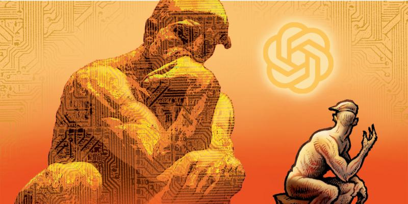

A thought-provoking WSJ article by Henry Kissinger, Eric Schmidt and Daniel Huttenlocher on the "intellectual revolution" brought by ChatGPT and generative AI:

- It compares the Age of Enlightenment to the new era of AI: the former delineates, dissects and explicates, while the latter accumulates, synthesizes and mystifies. (How do we avoid reaping the opposite effects of Enlightenment?)

- Our muscles of critical thinking and creating may atrophy to the point of us finding uncomfortable to challenge machines (think about the effect of GPS). We need to be "buttressed by elevated human skepticism", and learn how to collaborate with "a different kind of reasoning" -- rational but not necessarily reasonable. (But what would this skepticism do to the other human enterprises?)

- If quantum theory is correct in observation creating reality, rapid observations made by AI may fix the reality for us. Who would control the reality then? (A less radical disruption of reality is in the form of deepfakes)

- Temptation in monopolizing data for the advance of AI may entail new imperialism and divergence of civilizations.

- Educators must now teach new skills of responsibly collaborating with advanced AI. Fundamentally we need to "preserve a vision of humans as moral, psychological and strategic creatures uniquely capable of rendering holistic judgements".

- Ultimately as "HomoTechnicus" we need to define the purpose of our species. (Would we be able to it in time? Can we convince the entire populations to evolve harmoniously?)

Henry Kissinger, Eric Schmidt and Daniel Huttenlocher. ChatGPT Heralds an Intellectual Revolution. Wall Street Journal. Feb 24, 2023. [[1]](#ref-1)

*Originally posted on [LinkedIn](https://www.linkedin.com/posts/benjaminhan_opinion-chatgpt-heralds-an-intellectual-activity-7035687674908729344-MnM9).*

## References

[1] Henry Kissinger, Eric Schmidt and Daniel Huttenlocher. "ChatGPT Heralds an Intellectual Revolution." *Wall Street Journal*, February 24, 2023. <https://www.wsj.com/articles/chatgpt-heralds-an-intellectual-revolution-enlightenment-artificial-intelligence-homo-technicus-technology-cognition-morality-philosophy-774331c6>
