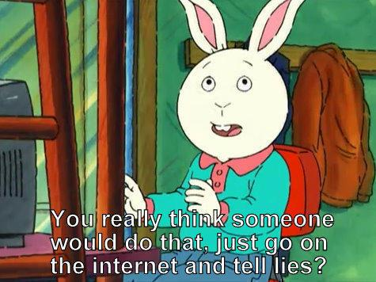

In observing the odd behaviors of ChatGPT and Bing Chat (see Kevin Roose from NYTimes [[1]](#ref-1)), an interesting blog discusses the "Waluigi Effect" of LLMs, i.e., the effect that prompting LLMs to behave would increase the odds of making it do the exact opposite (Waluigi is the evil counterpart of Luigi in the game Super Mario):

Cleo Nardo. The Waluigi Effect (mega-post). March 2023. [[2]](#ref-2)

Two interesting metaphors the author uses to describe LLMs:

- Metaphor 1: LLMs are simulators for text generation processes, and the characters invoked by the prompts are simulacra.
- Metaphor 2: LLMs are like quantum superpositions, and prompts act like observations that make the superpositions collapse to a few outcomes.

As to why, the author gave the following observations:

1. Rules/prompts are usually defined/described by explicating the undesirables
2. The above therefore makes them close in the representational space, i.e., once you reach Dr Jekyll, Mr. Hyde is not far away.
3. LLMs are also a "structural narratologist": it learns well a plot often involves a protagonist and a antagonist, and they are usually mirror images.

*Originally posted on [LinkedIn](https://www.linkedin.com/posts/benjaminhan_the-waluigi-effect-mega-post-lesswrong-activity-7040358016906366976-BlJm).*

## References

[1] Kevin Roose. "Bing's A.I. Chat: 'I Want to Be Alive.'" *The New York Times*, February 16, 2023. <https://www.nytimes.com/2023/02/16/technology/bing-chatbot-microsoft-chatgpt.html>

[2] Cleo Nardo. "The Waluigi Effect (mega-post)." *LessWrong*, March 2023. <https://www.lesswrong.com/posts/D7PumeYTDPfBTp3i7/the-waluigi-effect-mega-post>
