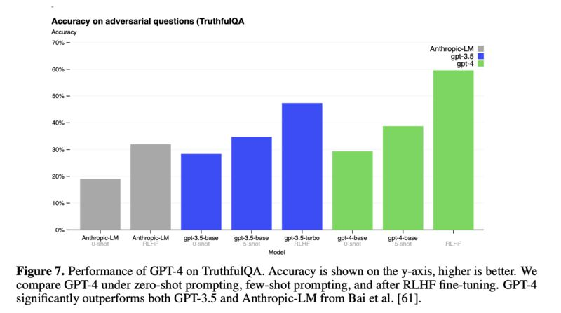

GPT4 is out today, and in the technical report they specifically reported the latest performance on TruthfulQA (see previous post [[1]](#ref-1) ).

OpenAI. GPT-4 Technical Report. March 2023. [[2]](#ref-2)

*Originally posted on [LinkedIn](https://www.linkedin.com/posts/benjaminhan_gpt4-openai-nlp-activity-7041479294803447809-EXtI).*

## References

[1] Benjamin Han. 2023. "TruthfulQA: Are Larger LLMs More Truthful?" <https://synesis2025.github.io/blog/posts/20230226-truthfulqa-llm-truthfulness/>

[2] <https://cdn.openai.com/papers/gpt-4.pdf>
