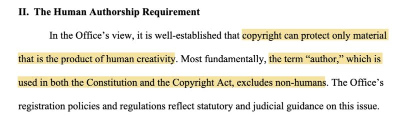
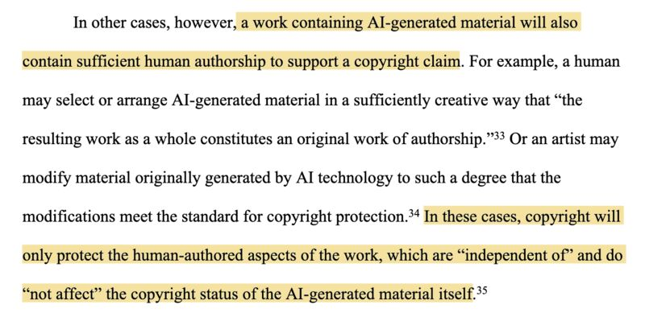
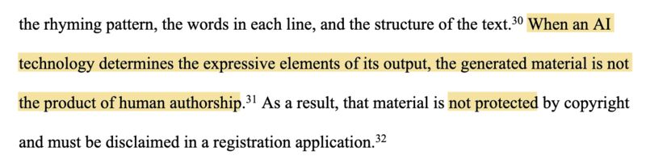
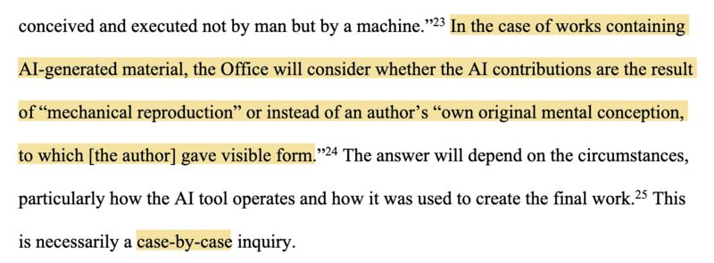

The US Copyright Office issued a registration guidance today concerning the copyright status of generative AI:

1. Machines cannot be an "author" (p.4).

2. Whether a work can be copyrighted depends on whether an author's "own original mental conception" is given a "visible form" (p.6).

3. When only machines determine the expressive elements of a work, it's not protected (p.7).

4. A work mixing human and machine effort has to have "sufficient" human authorship to be protected, and the protection only covers the "human-authored aspects" (p.8)

U.S. Copyright Office, Library of Congress. Copyright Registration Guidance: Works Containing Material Generated by Artificial Intelligence. March 2023. [[1]](#ref-1)

(On [Mastodon](https://sigmoid.social/@BenjaminHan))

*Originally posted on [LinkedIn](https://www.linkedin.com/posts/benjaminhan_copyright-generativeai-law-activity-7041999583173906434-deWK).*

## References

[1] U.S. Copyright Office, Library of Congress. "Copyright Registration Guidance: Works Containing Material Generated by Artificial Intelligence." March 2023. <https://public-inspection.federalregister.gov/2023-05321.pdf>
