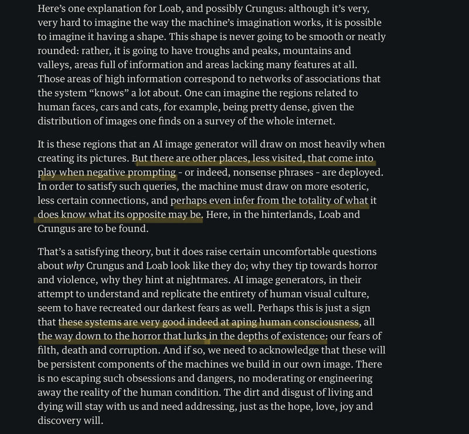

An interesting read from The Guardian on generative AI. The bits on "Crungus" and "Loab" caught my eyes:

- Negative prompting, i.e., prompting image generation models with nonsensical phrases, often elicits nightmarish images depicting blood, gore and violence.

- One conjecture is these models try to accomodate the statistically improbable prompts by sourcing from the opposite to what they know best: human imagery.

- Curious: does this happen to text generation models too?

James Bridle. The stupidity of AI. The Guardian. March 2023. [[1]](#ref-1)

(On [Mastodon](https://sigmoid.social/@BenjaminHan))

*Originally posted on [LinkedIn](https://www.linkedin.com/posts/benjaminhan_theguardian-generativeai-ethics-activity-7042877386572394497-tZk4).*

## References

[1] James Bridle. "The stupidity of AI." The Guardian. March 16, 2023. <https://www.theguardian.com/technology/2023/mar/16/the-stupidity-of-ai-artificial-intelligence-dall-e-chatgpt>
