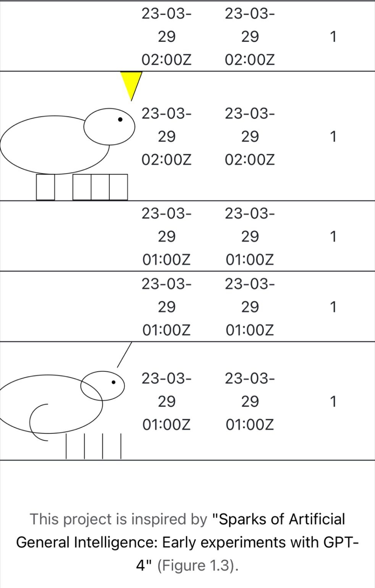

If GPT4 is a Turing Machine, it's a very nondeterministic one: Yuntian Deng uses it to draw a unicorn every hour with T=0 at [[1]](#ref-1).

*Originally posted on [LinkedIn](https://www.linkedin.com/posts/benjaminhan_gpt4-nlp-nlproc-activity-7047216440873025536-MiwK).*

## References

[1] <https://openaiwatch.com/>
