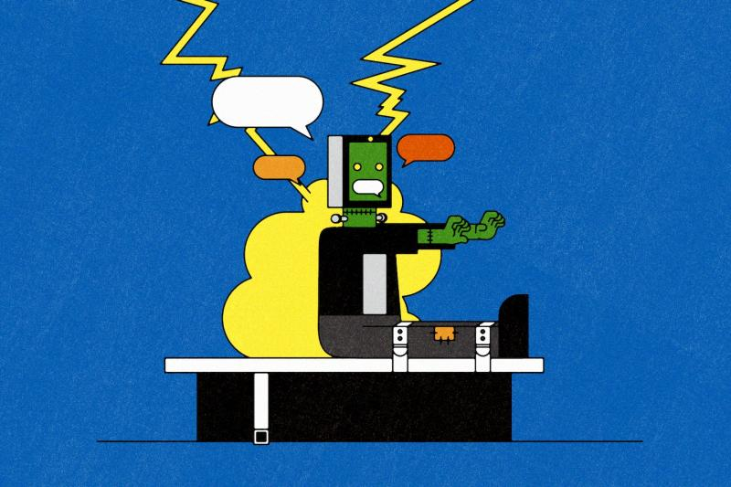

AI literacy [[1]](#ref-1):

1. Don't project human qualities (beware of anthropomorphism)
2. Don't view AI as a monolith
3. Be skeptical of AI tools (beware of automation bias)

*Originally posted on [LinkedIn](https://www.linkedin.com/posts/benjaminhan_3-things-everyones-getting-wrong-about-ai-activity-7047647052448608258-wWNe).*

## References

[1] "3 things everyone's getting wrong about AI." *The Washington Post*. March 2023. <https://www.washingtonpost.com/technology/2023/03/22/ai-red-flags-misinformation/>
