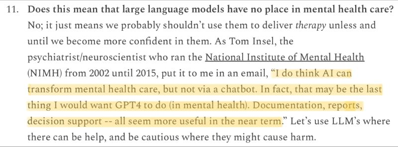

generative AI, LLMs, or AI in general are powerful tools but not without many flaws. Use them wisely.

Gary Marcus. March 2023. The first known chatbot associated death. [[1]](#ref-1)

(On [Mastodon](https://sigmoid.social/@BenjaminHan))

*Originally posted on [LinkedIn](https://www.linkedin.com/posts/benjaminhan_generativeai-llms-ai-activity-7049245392546271232-MeKZ).*

## References

[1] Gary Marcus. "The first known chatbot associated death." *Marcus on AI*, March 2023. <https://garymarcus.substack.com/p/the-first-known-chatbot-associated>
