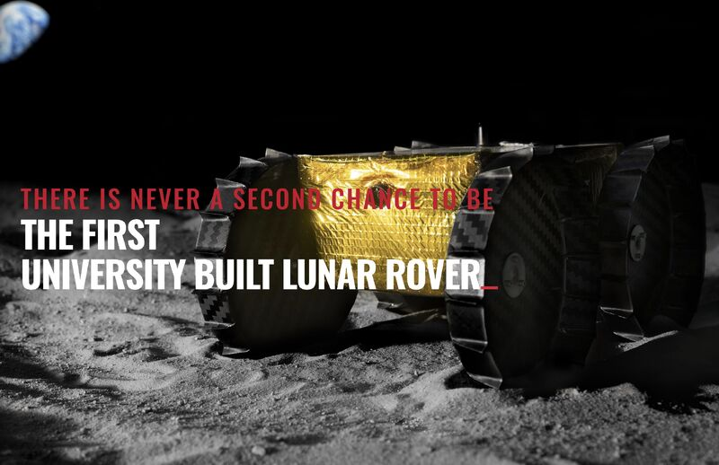

The first university built lunar rover Iris from Carnegie Mellon University Robotics is slated to launch on May 4th! Go Tartans!

- Announcement: [[1]](#ref-1)
- Iris: [[2]](#ref-2)
- MoonArk: [[3]](#ref-3)

(On [Mastodon](https://sigmoid.social/@BenjaminHan))

*Originally posted on [LinkedIn](https://www.linkedin.com/posts/benjaminhan_robotics-space-moon-activity-7050562763080822784-cWgW).*

## References

[1] <https://www.cmu.edu/news/stories/archives/2023/march/iris-rover-team-prepares-for-may-launch>

[2] <https://irislunarrover.space/>

[3] <https://www.cmu.edu/news/stories/archives/2019/july/humankind-time-capsule.html>
