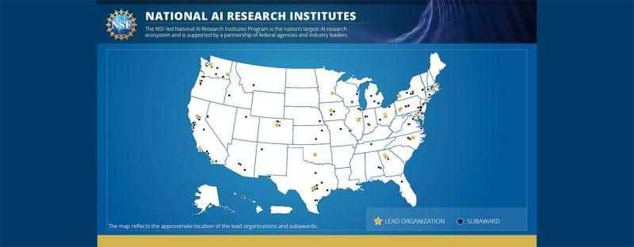

NSF Announces Seven New National Artificial Intelligence Research Institutes: [[1]](#ref-1)

- NSF Institute for Trustworthy AI in Law & Society (TRAILS)

- AI Institute for Agent-based Cyber Threat Intelligence and Operation (ACTION)

- AI Institute for Climate-Land Interactions, Mitigation, Adaptation, Tradeoffs and Economy (AI-CLIMATE)

- AI Institute for Artificial and Natural Intelligence (ARNI)

- AI-Institute for Societal Decision Making (AI-SDM)

- AI Institute for Inclusive Intelligent Technologies for Education (INVITE)

- AI Institute for Exceptional Education (AI4ExceptionalEd)

(On [Mastodon](https://sigmoid.social/@BenjaminHan))

*Originally posted on [LinkedIn](https://www.linkedin.com/posts/benjaminhan_nsf-announces-seven-new-national-artificial-activity-7059916087030673408-pRHw).*

## References

[1] National Science Foundation. May 4, 2023. "NSF Announces Seven New National Artificial Intelligence Research Institutes." <https://new.nsf.gov/news/nsf-announces-seven-new-national-artificial>
