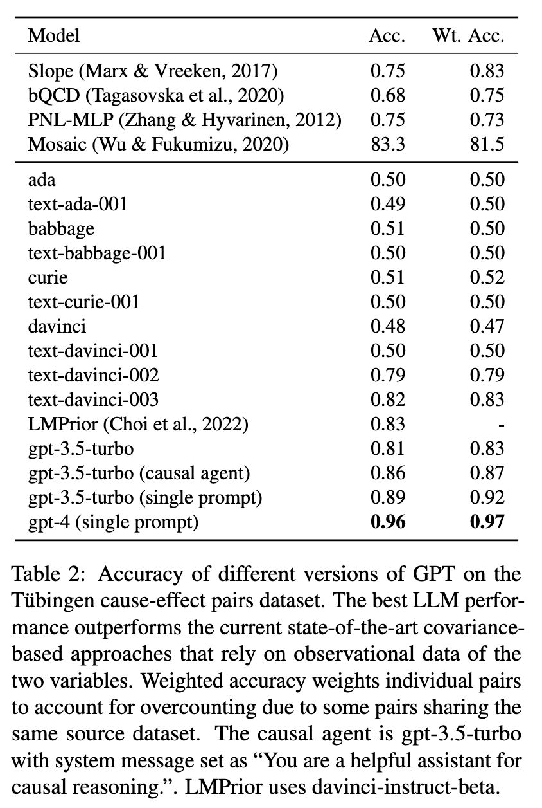

Solving causal reasoning tasks is a hallmark of intelligence. One recent study [[1]](#ref-1) categorizes these tasks into covariance-based and logic-based reasoning (screenshot 1) and examines how GPT models perform on causal discovery, actual causality, and causal judgments.

Notably, the study reports an impressively high accuracy of 96% achieved by GPT4 (screenshot 2) on the Tübingen benchmark [[2]](#ref-2), which is a classification task that determines whether a change in one variable (e.g., age of abalone) causes a change in another variable (e.g., height of abalone).

But upon examining one error, it appears that the model did not truly "reason" (screenshot 3). The authors further conducted a "memorization test" with the model, asking it to recall part of the dataset while providing the other part in the prompts. The results show that the Tübingen benchmark is already in GPT4's training set (screenshot 4)!

Coincidentally, another recent study systematically tests how many books GPT models have memorized [[3]](#ref-3). The researchers used a similar approach in the form of a name cloze test (screenshot 5) and found that the models do retain substantial information from these books (GPT4 remembers more than ChatGPT; screenshot 6). They also discovered that a significant amount of copyrighted material is present (screenshot 7). Last but definitely not the least, they demonstrated how well the models perform on a task— predicting the first publication date of a random 250-word sample from a book—strongly depends on how much they have seen the task data before (screenshot 8).

The moral of the story: when investigating capabilities of black-box LLMs, always perform memorization tests first on the benchmark datasets!

REFERENCES

*Originally posted on [LinkedIn](https://www.linkedin.com/posts/benjaminhan_reasoning-gpt-gpt4-activity-7060428182910373888-JnGQ).*

## References

[1] Emre Kiciman, Robert Osazuwa Ness, Amit Sharma, and Chenhao Tan. 2023. "Causal Reasoning and Large Language Models: Opening a New Frontier for Causality." <http://arxiv.org/abs/2305.00050>

[2] Joris M. Mooij, Jonas Peters, Dominik Janzing, Jakob Zscheischler, and Bernhard Schölkopf. 2016. "Distinguishing Cause from Effect Using Observational Data: Methods and Benchmarks." *Journal of Machine Learning Research*, 17(32):1–102. <https://jmlr.org/papers/v17/14-518.html>

[3] Kent Chang, Mackenzie Cramer, Sandeep Soni, and David Bamman. 2023. "Speak, Memory: An Archaeology of Books Known to ChatGPT/GPT-4." <http://arxiv.org/abs/2305.00118>
