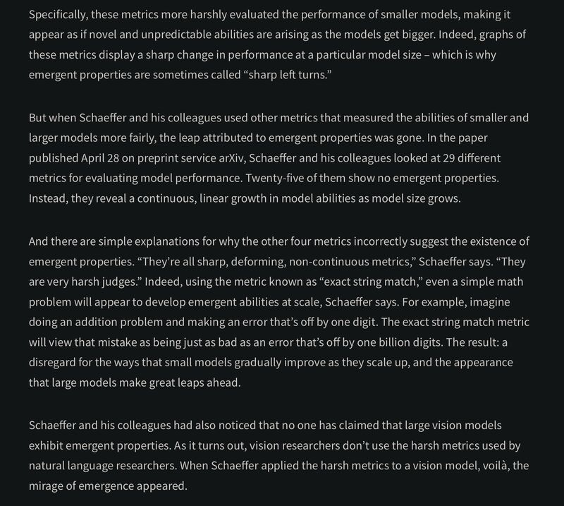

Blog: [[1]](#ref-1)

Paper: Rylan Schaeffer, Brando Miranda, and Sanmi Koyejo. 2023. "Are Emergent Abilities of Large Language Models a Mirage?" ArXiv [Cs.AI]. arXiv. [[2]](#ref-2).

*(On [Mastodon](https://sigmoid.social/@BenjaminHan))*

*Originally posted on [LinkedIn](https://www.linkedin.com/posts/benjaminhan_ai-paper-llm-activity-7062092886439301121-ashr).*

## References

[1] "AI's Ostensible Emergent Abilities Are a Mirage." *Stanford HAI*. <https://hai.stanford.edu/news/ais-ostensible-emergent-abilities-are-mirage>

[2] Rylan Schaeffer, Brando Miranda, and Sanmi Koyejo. 2023. "Are Emergent Abilities of Large Language Models a Mirage?" arXiv:2304.15004. <http://arxiv.org/abs/2304.15004>
