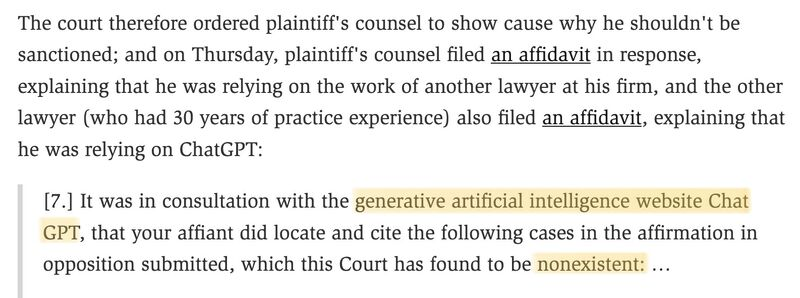

Courts need a tool to fact check all the briefs.

Eugene Volokh. May 27, 2023. A Lawyer's Filing "Is Replete with Citations to Non-Existent Cases"—Thanks, ChatGPT? Reason. [[1]](#ref-1)

(On [Mastodon](https://sigmoid.social/@BenjaminHan))

*Originally posted on [LinkedIn](https://www.linkedin.com/posts/benjaminhan_chatgpt-law-ethics-activity-7068236432502358016-5Gk8).*

## References

[1] Eugene Volokh. May 27, 2023. "A Lawyer's Filing 'Is Replete with Citations to Non-Existent Cases'—Thanks, ChatGPT?" *Reason*. <https://reason.com/volokh/2023/05/27/a-lawyers-filing-is-replete-with-citations-to-non-existent-cases-thanks-chatgpt/>
