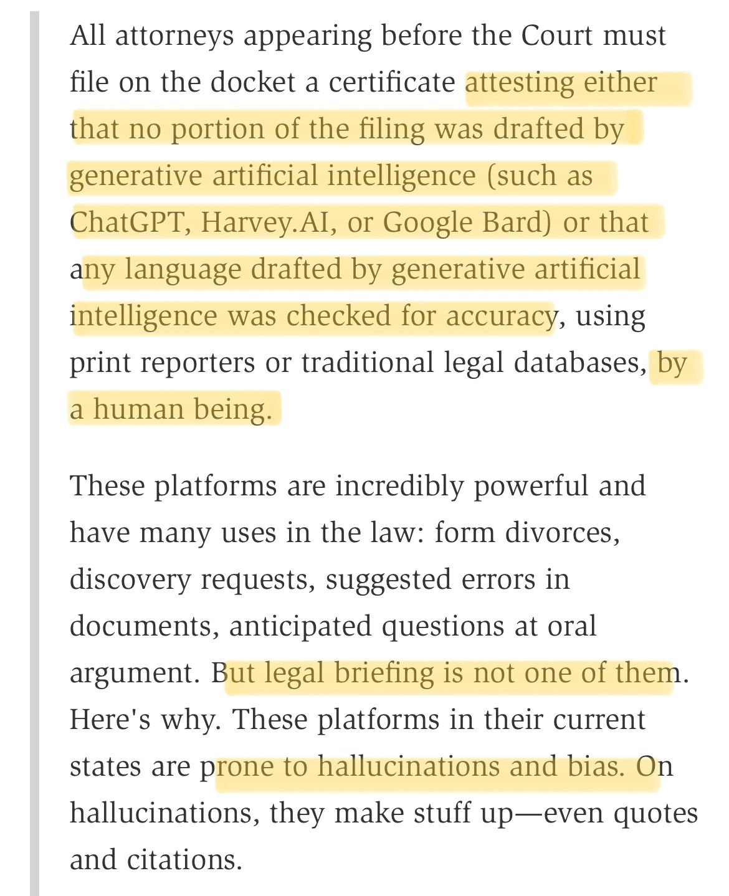

Federal Judge Requires All Lawyers to File Certificates Related to Use of Generative AI

[[1]](#ref-1)

(On [Mastodon](https://sigmoid.social/@BenjaminHan))

*Originally posted on [LinkedIn](https://www.linkedin.com/posts/benjaminhan_law-ethics-generativeai-activity-7069532698838532096-CH5K).*

## References

[1] Eugene Volokh. May 2023. "Federal Judge Requires All Lawyers to File Certificates Related to Use of Generative AI." *The Volokh Conspiracy / Reason*. <https://reason.com/volokh/2023/05/30/federal-judge-requires-all-lawyers-to-file-certificates-related-to-use-of-generative-ai/>
