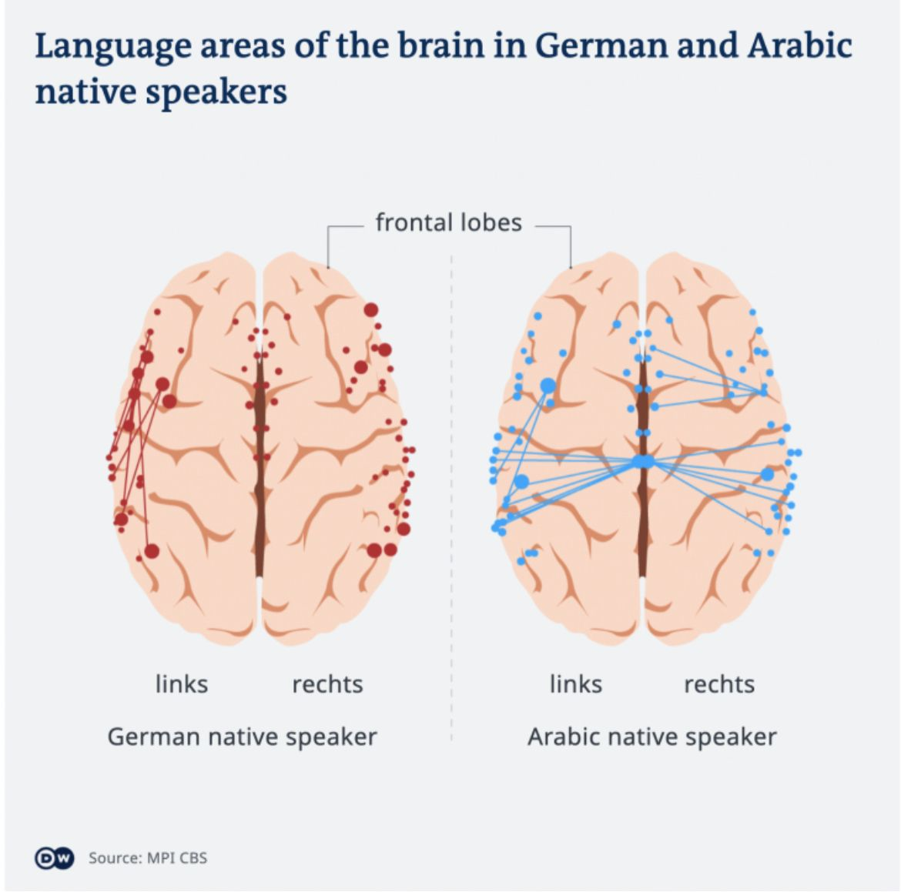

“A native speaker of Arabic must concentrate precisely on how the word is pronounced and what meaning it has as a result: did his conversation partner say "kitabun" (book) or "katib" (writer)?

In the native speakers of German, the scientists found stronger connections in the left hemisphere of the brain and towards the frontal lobe in the frontal area of the brain. This can also be explained by the nature of the German language since these regions are responsible for processing sentence structure.”

Language and language acquisition: How the brain processes German and Arabic - https://lnkd.in/gPPa4dVT

Paper:
Xuehu Wei, Helyne A., Matthias Schwendemann, Tomás Goucha, Angela Friederici, and Alfred Anwander. 2023. Native language differences in the structural connectome of the human brain. NeuroImage, 270:119955. https://lnkd.in/gKwV6nbE

NLP NLProc Multilingual Neuroscience Neurolinguistics | 44 comments on LinkedIn

*Originally posted on [LinkedIn](https://www.linkedin.com/posts/benjaminhan_nlp-nlproc-multilingual-activity-7075330874820460544-iIvm).*

## References

[1] "Language and language acquisition: How the brain processes German and Arabic." *Qantara.de*. <https://en.qantara.de/content/language-and-language-acquisition-how-the-brain-processes-german-and-arabic>

[2] Xuehu Wei, Helyne A., Matthias Schwendemann, Tomás Goucha, Angela Friederici, and Alfred Anwander. 2023. "Native language differences in the structural connectome of the human brain." *NeuroImage*, 270:119955. <https://www.researchgate.net/publication/368657502_Native_language_differences_in_the_structural_connectome_of_the_human_brain>
