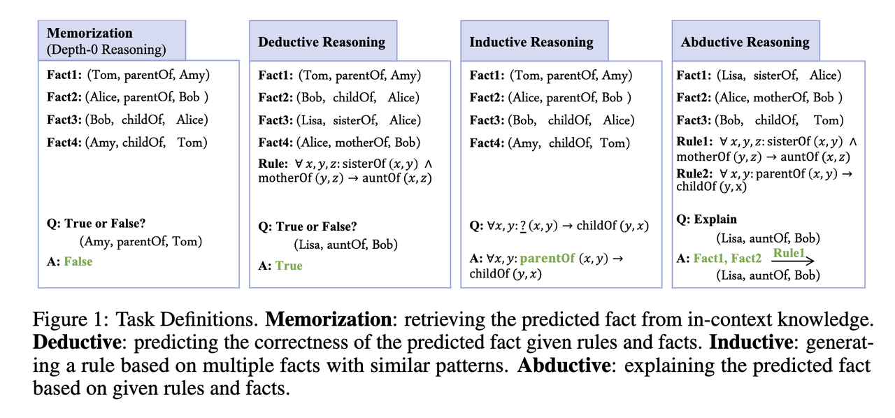

When performing reasoning or generating code, do LLMs really understand what they're doing, or do they just memorize? Several new results seem to have painted a not-so-rosy picture.

The authors in [[1]](#ref-1) are interested in testing LLMs on "semantic" vs. "symbolic" reasoning: the former involves reasoning with language-like input, and the latter is reasoning with abstract symbols. They use a symbolic dataset and a semantic dataset to test models' abilities on memorization and reasoning (Fig. 1). For each dataset they created a corresponding one in the other modality, e.g., they replace natural language labels for the relations and the entities with abstract symbols to create a symbolic version of a semantic dataset (Fig. 2). The end result? LLMs perform much worse on *symbolic* reasoning (Fig. 3), suggesting they leverage heavily on the semantics of the words involved rather than really understand and follow reasoning patterns.

.](fig1.jpg)

.](fig2.jpg)

.](fig3.jpg)

The same tendency is borne out by another paper focusing on testing code-generating LLMs when function names are *swapped* in the input [[2]](#ref-2) (Fig. 4). They not only found almost all models failed completely, but also most of them exhibit an "inverse scaling" effect: the larger a model is, the worse it gets (Fig. 5). This shows the semantic priors learned from these function names have totally dominated, and the models don't really understand what they are doing.

.](fig4.jpg)

.](fig5.jpg)

How about LLMs on causal reasoning? There have been reports of extremely impressive performance of GPT 3.5 and 4, but these models also lack consistency in performance and even possibly have cheated by memorizing the tests [[3]](#ref-3), as discussed in a previous [post](../20230506-llm-causal-reasoning-memorization/). In a more recent work [[5]](#ref-5), the authors tested LLMs on *pure* causal inference tasks, where all variables are now symbolic (Fig. 6). They constructed systematically a dataset starting by picking variables, to generating all possible causal graphs, to finally mapping all possible statistical correlations. They then "verbalize" these graphs into problems for LLMs to solve for a given causation hypothesis (Fig. 7). The results? Both GPT-4 and Alpaca perform worse than BART fine-tuned with MNLI, and not much better than the uniform random baseline (Fig. 8).

.](fig6.jpg)

.](fig7.jpg)

.](fig8.jpg)

(On [Mastodon](https://sigmoid.social/@BenjaminHan/110687186074579773))

*Originally posted on [LinkedIn](https://www.linkedin.com/pulse/do-llms-really-understand-recent-papers-reveal-benjamin-han/).*

## References

[1] Xiaojuan Tang, Zilong Zheng, Jiaqi Li, Fanxu Meng, Song-Chun Zhu, Yitao Liang, and Muhan Zhang. 2023. "Large Language Models are In-Context Semantic Reasoners rather than Symbolic Reasoners." <http://arxiv.org/abs/2305.14825>

[2] Antonio Valerio Miceli-Barone, Fazl Barez, Ioannis Konstas, and Shay B. Cohen. 2023. "The Larger They Are, the Harder They Fail: Language Models do not Recognize Identifier Swaps in Python." <http://arxiv.org/abs/2305.15507>

[3] Emre Kıcıman, Robert Ness, Amit Sharma, and Chenhao Tan. 2023. "Causal Reasoning and Large Language Models: Opening a New Frontier for Causality." <http://arxiv.org/abs/2305.00050>

[5] Zhijing Jin, Jiarui Liu, Zhiheng Lyu, Spencer Poff, Mrinmaya Sachan, Rada Mihalcea, Mona Diab, and Bernhard Schölkopf. 2023. "Can Large Language Models Infer Causation from Correlation?" <http://arxiv.org/abs/2306.05836>
