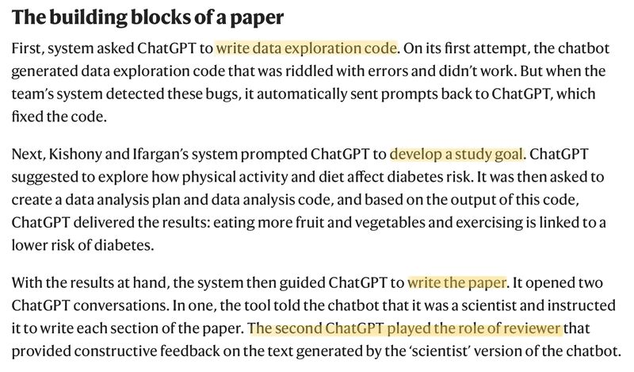

Scientific exploration and writing in the age of GenerativeAI:

"The researchers [Roy Kishony and Tal Ifargan] designed a software package that automatically fed prompts to ChatGPT and built on its responses to refine the paper over time. This autonomous data-to-paper system led the chatbot through a step-by-step process that mirrors the scientific process, from initial data exploration, through writing data analysis code and interpreting the results, to writing a polished manuscript." [[1]](#ref-1)

To be honest certain aspects of this new regime is actually quite appealing. But what about the idea "Writing is Thinking" [[2]](#ref-2)[[3]](#ref-3)? Will we witness a generation suffering from intellectual muscle atrophy?

---

*Originally posted on [LinkedIn](https://www.linkedin.com/posts/benjaminhan_writing-generativeai-chatgpt-activity-7084760687985496064-Fv3b).*

## References

[1] Gemma Conroy. 2023. "Scientists used ChatGPT to generate an entire paper from scratch - but is it any good?" *Nature*. <http://dx.doi.org/10.1038/d41586-023-02218-z>

[2] Steven Mintz. November 2021. "Writing Is Thinking." *Inside Higher Ed*. <https://www.insidehighered.com/blogs/higher-ed-gamma/writing-thinking>

[3] Steph Smith. October 2019. "Writing is Thinking: Learning to Write with Confidence." <https://blog.stephsmith.io/learning-to-write-with-confidence/>
