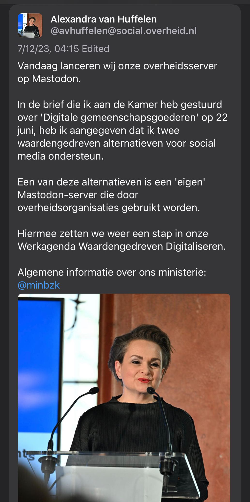

The Dutch government is now running their own Mastodon instance, after the German government and the EuropeanCommission.

Translation:

“Today we are launching our government server on Mastodon.

In the letter I sent to the House on 'Digital Community Goods' on 22 June, I indicated that I support two value-driven alternatives to social media.

One of these alternatives is an 'owned' Mastodon server used by government organisations.

With this, we are taking another step in our Value-driven Digitization Work Agenda.

General information about our ministry: @minbzk”

https://lnkd.in/gS6nkWNC

*Originally posted on [LinkedIn](https://www.linkedin.com/posts/benjaminhan_mastodon-europeancommission-activity-7085263835917385729-aULz).*

## References

[1] Alexandra van Huffelen (@avhuffelen). Mastodon post, social.overheid.nl, 2023-07-13. <https://social.overheid.nl/@avhuffelen/110700825255524685>
