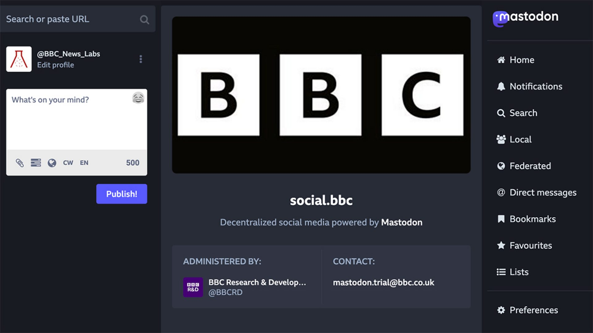

BBC is now on Mastodon:

> "This is an experiment - we will run it for 6 months and then decide whether and how to continue. We aim to learn how much value it has provided and how much work and cost is involved. Does it reach enough people for the effort we need to put in? Are there risks or benefits from the federated model, with no centralised rules or moderation and no filtering or sorting algorithms?"

The BBC on Mastodon: experimenting with distributed and decentralised social media [[1]](#ref-1)

(NPR is already on it as <https://press.coop/@NPR>)

*Originally posted on [LinkedIn](https://www.linkedin.com/posts/benjaminhan_the-bbc-on-mastodon-experimenting-with-distributed-activity-7091842851315060736-7RJG).*

## References

[1] BBC R&D. "The BBC on Mastodon: experimenting with distributed and decentralised social media." *BBC R&D Blog*, July 2023. <https://www.bbc.co.uk/rd/blog/2023-07-mastodon-distributed-decentralised-fediverse-activitypub/>
