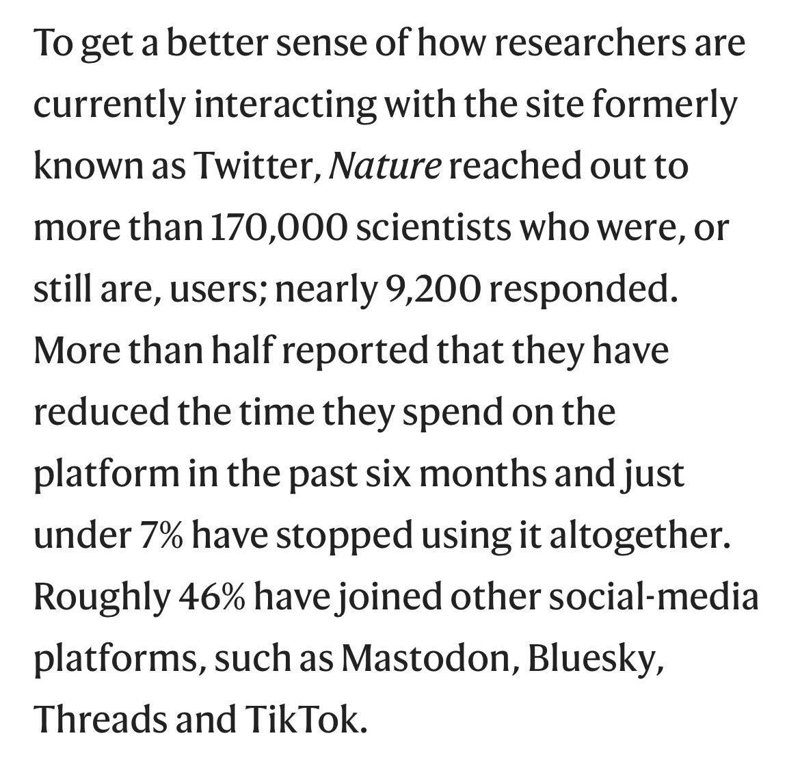

Nature surveyed 170+k scientists:

> "The most popular alternative social-media site that respondents mentioned opening accounts with was the free, open-source software platform Mastodon."

Thousands of scientists are cutting back on Twitter, seeding angst and uncertainty [[1]](#ref-1)

*Originally posted on [LinkedIn](https://www.linkedin.com/posts/benjaminhan_nature-scientists-mastodon-activity-7097618375924740096-n_vU).*

## References

[1] "Thousands of scientists are cutting back on Twitter, seeding angst and uncertainty." *Nature*, 2023. <https://www.nature.com/articles/d41586-023-02554-0>
