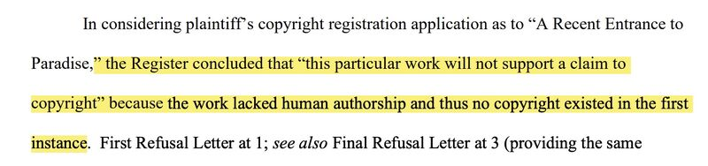
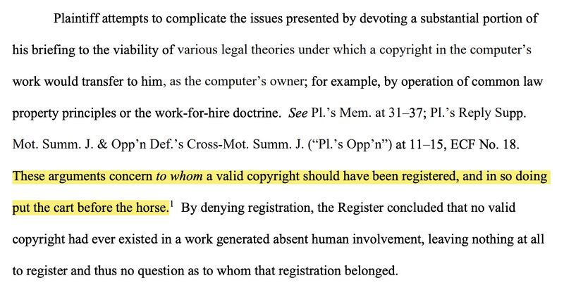
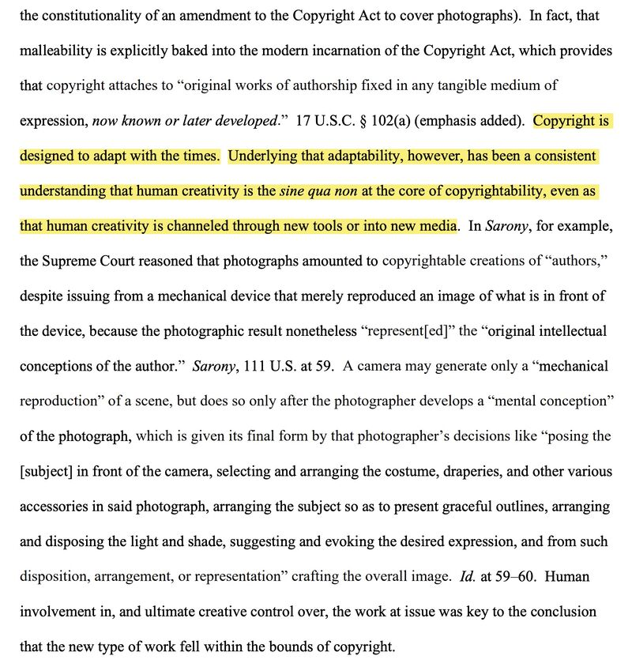

US District Judge ruled an AI-generated artwork can't be copyrighted because it "lacked human authorship and thus no copyright existed in the first instance."

Wes Davis. August 2023. AI-generated art cannot be copyrighted, rules a US Federal Judge. The Verge. [[1]](#ref-1)

Previously:

1. The US Copyright Office issued a registration guidance concerning the copyright status of generative AI: [[2]](#ref-2)

2. Henderson et al 2023 from Stanford published paper "Foundation Models and Fair Use": [[3]](#ref-3)

*Originally posted on [LinkedIn](https://www.linkedin.com/posts/benjaminhan_authorship-copyright-generativeai-activity-7098809165434822657-kpT3).*

---

## References

[1] Wes Davis. "AI-generated art cannot be copyrighted, rules a US Federal Judge." *The Verge*, August 19, 2023. <https://www.theverge.com/2023/8/19/23838458/ai-generated-art-no-copyright-district-court>

[2] U.S. Copyright Office. Registration guidance on works containing material generated by AI. Federal Register, 2023. <https://public-inspection.federalregister.gov/2023-05321.pdf>

[3] Peter Henderson, Xuechen Li, Dan Jurafsky, Tatsunori Hashimoto, Mark A. Lemley, and Percy Liang. "Foundation Models and Fair Use." 2023. <https://arxiv.org/abs/2303.15715>
