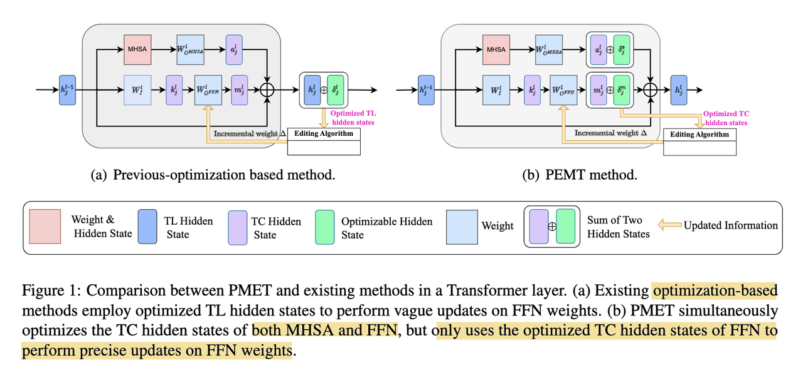

Can we "edit" to update incorrect/outdated facts without costly retraining? Recent works such as training auxiliary models to predict weight changes in the main model (MEND) [[1]](#ref-1), locating "knowledge neurons" [[2]](#ref-2), using causal intervention to identify feed-forward network (FFN) weights to edit in ROME [[3]](#ref-3), and scaling up editing operations to thousands of associations in MEMIT [[4]](#ref-4) have proven it's doable, even practical.

Building on ROME/MEMIT, the authors of a more recent work [[5]](#ref-5) hypothesize that optimizing transformer layer hidden states to update knowledge may be too much, as these parameters contain simultaneously the effect from Multi-head Self-Attention (MHSA), feed-forward network (FFN), and residual connections.

By computing the similarities of the hidden states of MHSA and FFN before and after each layer, they observe FFN stabilizes much earlier than MHSA, thus concluding that MHSA encodes more general knowledge extraction patterns while FFN captures more factual aspect of knowledge (screenshot 1).

.](screenshot1.jpg)

They then propose PMET (Precise Model Editing in a Transformer), which effectively moves weight optimization upstream. And while trying to optimize both MHSA and FFN, it only updates on FFN weights to preserve specificity (screenshot 2). The result is much more stable performance as number of edits increases (screenshot 3), and better overall results (screenshot 4).

.](screenshot2.jpg)

.](screenshot3.jpg)

.](screenshot4.jpg)

Another related recent work is on how to properly evaluate model editing [[6]](#ref-6). Instead of just assessing whether an individual fact has been successfully injected or if similar predictions for other subjects have not changed, the *consequences* of these updates, aka "ripple effects", should also be evaluated (screenshot 5). It'd be interesting to see how "complete" various model editing methods can achieve (screenshot 6), and how to achieve a better tradeoff between completeness and efficiency.

.](screenshot5.jpg)

.](screenshot6.jpg)

*Originally posted on [LinkedIn](https://www.linkedin.com/pulse/model-editing-performing-digital-brain-surgery-benjamin-han/).*

## References

[1] Eric Mitchell, Charles Lin, Antoine Bosselut, Chelsea Finn, and Christopher D. Manning. 2021. "Fast Model Editing at Scale." <http://arxiv.org/abs/2110.11309>

[2] Damai Dai, Li Dong, Yaru Hao, Zhifang Sui, Baobao Chang, and Furu Wei. 2021. "Knowledge Neurons in Pretrained Transformers." <http://arxiv.org/abs/2307.14988>

[3] Kevin Meng, David Bau, Alex Andonian, and Yonatan Belinkov. 2022. "Locating and editing factual associations in GPT." *Advances in Neural Information Processing Systems*, 35:17359–17372. <https://arxiv.org/abs/2202.05262>

[4] Kevin Meng, Arnab Sen Sharma, Alex Andonian, Yonatan Belinkov, and David Bau. 2022. "Mass-Editing Memory in a Transformer." <http://arxiv.org/abs/2210.07229>

[5] Xiaopeng Li, Shasha Li, Shezheng Song, Jing Yang, Jun Ma, and Jie Yu. 2023. "PMET: Precise Model Editing in a Transformer." *arXiv [cs.CL]*. <http://arxiv.org/abs/2308.08742>

[6] Roi Cohen, Eden Biran, Ori Yoran, Amir Globerson, and Mor Geva. 2023. "Evaluating the Ripple Effects of Knowledge Editing in Language Models." <http://arxiv.org/abs/2307.12976>
