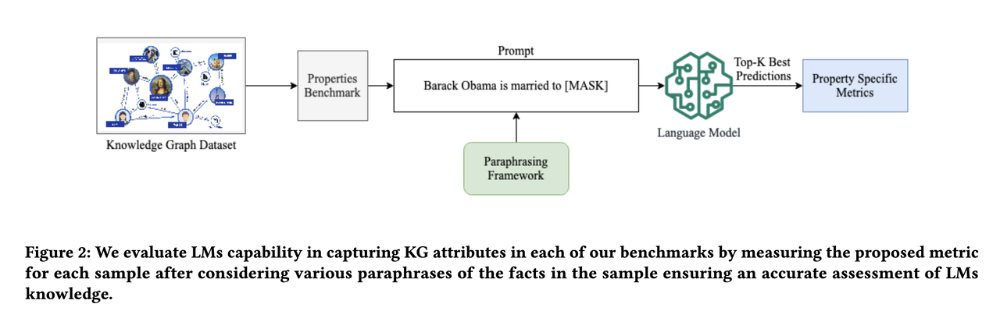

In this age of LLMs and generative AI, do we still need knowledge graphs (KGs) as a way to collect and organize domain and world knowledge, or should we just switch to language models and rely on their abilities to absorb knowledge from massive training datasets?

An early paper in 2019 [[1]](#ref-1) posited that compared to KGs, it is easier for language models to adapt to new data without human supervision, and they allow users to query about an open class of relations without much restriction. To measure the knowledge encoding capability, the authors construct the LAMA (Language Model Analysis) probe where facts are turned into cloze statements and language models are asked to predict the masked words. The result shows that even without specialized training, language models such as BERT-large can already retrieve decent amount of facts from their weights.

.](screenshot1.jpg)

.](screenshot2.jpg)

But is that all? A recent paper revisits this question and offers a different take [[2]](#ref-2). The authors believe just testing isolated fact retrieval is not sufficient to demonstrate the power of KGs. Instead, they focus on more intricate topological and semantic attributes of facts, and propose 9 benchmarks testing modern LLMs' capability in retrieving facts with the following attributes: symmetry, asymmetry, hierarchy, bidirectionality, compositionality, paths, entity-centricity, bias and ambiguity.

.](screenshot3.jpg)

.](screenshot4.jpg)

In each benchmark, instead of asking LLMs to retrieve masked words from a cloze statement, it also asks the LLMs to retrieve all of the implied facts and compute scores accordingly. Their result shows that even GPT4 achieves only 23.7% hit@1 on average, even when it scores up to 50% precision@1 using the earlier proposed LAMA benchmark. Interestingly, smaller models like BERT can outperform GPT4 on bidirectional, compositional, and ambiguity benchmarks, indicating bigger is not necessarily better.

.](screenshot5.jpg)

.](screenshot6.jpg)

There are surely other benefits of using KGs to collect and organize knowledge. They do not require costly retraining to update, therefore can be updated more frequently to remove obsolete or incorrect facts. They allow more trackable reasoning and can offer better explanations. They make fact editing more straightforward and accountable (think of GDPR) compared to model editing [[3]](#ref-3). But LLMs can certainly help in bringing in domain-specific or commonsense knowledge in a data-driven way. In conclusion: why not both [[4]](#ref-4)?  :-)

*Originally posted on [LinkedIn](https://www.linkedin.com/pulse/give-us-facts-large-language-models-vs-knowledge-graphs-benjamin-han/).*

---

## References

[1] Fabio Petroni, Tim Rocktäschel, Patrick Lewis, Anton Bakhtin, Yuxiang Wu, Alexander H. Miller, and Sebastian Riedel. "Language Models as Knowledge Bases?" 2019. <https://arxiv.org/abs/1909.01066>

[2] Vishwas Mruthyunjaya, Pouya Pezeshkpour, Estevam Hruschka, and Nikita Bhutani. "Rethinking Language Models as Symbolic Knowledge Graphs." 2023. <https://arxiv.org/abs/2308.13676>

[3] Benjamin Han. "Model Editing: Performing Digital Brain Surgery." LinkedIn, 2023. <https://www.linkedin.com/posts/benjaminhan_llms-causal-papers-activity-7101756262576525313-bIge>

[4] Shirui Pan, Linhao Luo, Yufei Wang, Chen Chen, Jiapu Wang, and Xindong Wu. "Unifying Large Language Models and Knowledge Graphs: A Roadmap." 2023. <https://arxiv.org/abs/2306.08302>
