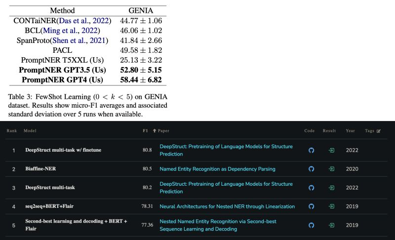

Previously we discussed the power of In-Context Learning (ICL) emerging from LLMs [[1]](#ref-1), but has its magic solved one of the basic NLP tasks, Named Entity Recognition (NER)? A recent post from the original author of spaCy and Explosion CTO, Matthew Honnibal, says not [[2]](#ref-2):

“Okay. So, here's something that might surprise you: ICL actually sucks at most predictive tasks currently. Let's take NER. Performance on NER on some datasets is _below 2003_.”

One particular recent paper in the discussion proposed an ICL approach named PromptNER [[3]](#ref-3), and reported SOTA results among its ICL peers on well-known datasets such as CoNLL 2003 and GENIA. Comparing its results with the SOTA *fine-tuning* (FT) solutions, FT outperforms on CoNLL by 10+ points (94.6 vs. 83.48; screenshot 1) [[4]](#ref-4), and outperforms on GENIA too by 20+ points (80.8 vs. 58.44; screenshot 2) [[5]](#ref-5).

REFERENCES

*Originally posted on [LinkedIn](https://www.linkedin.com/posts/benjaminhan_icl-llms-nlp-activity-7106309703839715328-634A).*

---

## References

[1] Previous LinkedIn posts on ICL and why it works (linking to substack discussion and arxiv:2212.10559). <https://goodaivibes.substack.com> · <https://arxiv.org/abs/2212.10559>

[2] Matthew Honnibal. Hacker News comment on ICL and NER. <https://news.ycombinator.com/item?id=37443921>

[3] Dhananjay Ashok and Zachary Lipton. "PromptNER: Prompting For Named Entity Recognition." 2023. <https://arxiv.org/abs/2305.15444>

[4] Papers With Code — Named Entity Recognition (NER) on CoNLL 2003. <https://paperswithcode.com/sota/named-entity-recognition-ner-on-conll-2003>

[5] Papers With Code — Named Entity Recognition on GENIA. <https://paperswithcode.com/sota/named-entity-recognition-on-genia>
