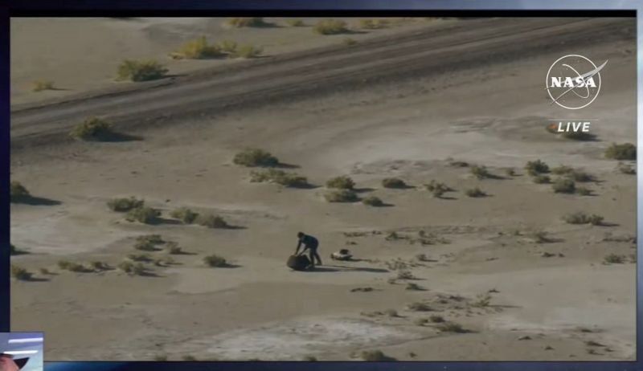

(Someone left a package in the middle of desert?)

From 27,650 mph to 0 in 4 hours, across 63,000 miles in distance, and then — bullseye!

* A long-awaited asteroid sample has landed in the US (CNN) [[1]](#ref-1)
* A NASA Spacecraft Comes Home With an Asteroid Gift for Earth (NYTimes) [[2]](#ref-2)

*Originally posted on [LinkedIn](https://www.linkedin.com/posts/benjaminhan_nasa-space-bennu-activity-7111740661472641024-GCP2).*

---

## References

[1] "A long-awaited asteroid sample has landed in the US." *CNN*, September 24, 2023. <https://www.cnn.com/2023/09/24/world/osiris-rex-asteroid-sample-return-scn/index.html>

[2] "A NASA Spacecraft Comes Home With an Asteroid Gift for Earth." *The New York Times*, September 24, 2023. <https://www.nytimes.com/2023/09/24/science/nasa-osiris-rex-asteroid-sample-landing.html>
