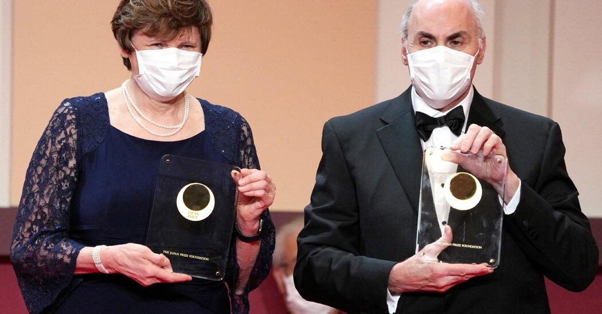

"Katalin Karikó and Drew Weissman, who together identified a chemical tweak to messenger RNA, were awarded the Nobel Prize in Physiology or Medicine on Monday. Their work enabled potent Covid vaccines to be made in less than a year, averting tens of millions of deaths and helping the world recover from the worst pandemic in a century." [[1]](#ref-1)

Thank you, Dr. Karikó and Dr. Weissman!

*Originally posted on [LinkedIn](https://www.linkedin.com/posts/benjaminhan_nobel-prize-awarded-to-covid-vaccine-pioneers-activity-7114636847426801665-0ItL).*

---

## References

[1] "Nobel Prize Awarded to Covid Vaccine Pioneers." *The New York Times*, October 2, 2023. <https://www.nytimes.com/2023/10/02/health/nobel-prize-medicine.html>
