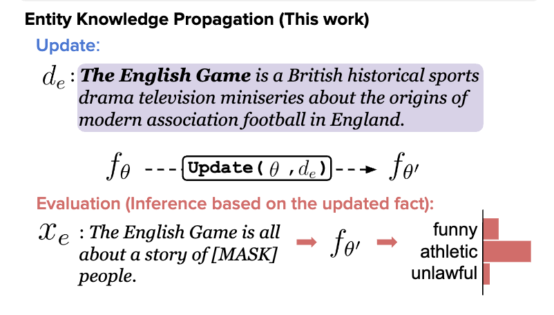

If a powerful LLM is told that "Daphne Barrington is the director of *A Journey Through Time*", it would surely be able to answer the question "Who is the director of *A Journey Through Time*?", right? Well, according to a recent paper [[1]](#ref-1), not quite. They found that after being fine-tuned with sentences of pattern "&lt;name&gt; is &lt;description&gt;", LLMs such as GPT-3 175B, 2.7B and Llama-7B completely failed at answering questions in the reverse pattern "&lt;description&gt; is &lt;name&gt;" (results of GPT3 175B). The fine-tuned models actually scored the correct answer no different from a random answer!

.](screenshot1.jpg)

.](screenshot2.jpg)

.](screenshot3.jpg)

The authors above name this phenomenon "the Reversal Curse". If you have read the paper discussed previously in [[2]](#ref-2) that shows LLMs fail at retrieving more intricate topological and semantic attributes of facts, you'd know this is not entirely surprising: inverse relations are just one type of ontology topology (or predicate entailment) that these models are not good at. The interesting bit here is that this performance gap exists even after fine-tuning with one side of the relations.

These discoveries are actually quite relevant to another effort we had previously discussed: model editing [[3]](#ref-3). There the goal is to surgically change model weights to update outdated or incorrect facts buried inside the LLMs' parametric knowledge. One crucial consideration is that the editing should not only successfully update the targeted facts, but it should also update all the facts that can be inferred from the changes, i.e., updating according to the "ripple effects". Cast in this light, LLMs' failure of recognizing "B is A" even after learning "A is B" is just a case of not being able to account for one of the most rudimentary ripple effects.

If we follow this train of thought, the paper at the top actually cast doubt on the idea of performing model editing via fine-tuning, because it cannot account for the ripple effects. Fine-tuning has also been discredited when used for this purpose in an ACL 2023 paper [[4]](#ref-4), where it was compared to popular model editing methods such as MEND, ROME, and In-Context Learning (ICL, aka prompting). The authors formulated three tasks, and the edited models were given probe sentences to answer:

.](screenshot4.jpg)

Two metrics were deployed to measure model performance before and after model editing: Target measures the delta accuracy (for Entity Inferences task; higher is better) or the delta perplexity of the targeted entities (for the two ECBD tasks; lower is better), and Specificity measures the delta accuracy or the delta perplexity of the non-targeted entities (same as above, respectively; 0 is the best). The result shows fine-tuning (FT) failed at Specificity for Entity Inferences and Target for ECBD. ECBD is hard because unlike Entity Inferences, textual overlapping is not guaranteed between input and output (ECBD-Easy relaxed this restriction a bit therefore FT was not as bad at Target, at least for the decoder-only models).

.](screenshot5.jpg)

In summary, fine-tuning in the current form as a way to perform model editing is not good at ripple effects, is not good at updating the targeted facts when textual overlap is low, and is not good at not affecting non-targeted facts when textual overlap is high.

The search is on!

*Originally posted on [LinkedIn](https://www.linkedin.com/pulse/from-reversal-curse-teaching-large-language-models-new-benjamin-han/).*

---

## References

[1] Lukas Berglund, Meg Tong, Max Kaufmann, Mikita Balesni, Asa Cooper Stickland, Tomasz Korbak, and Owain Evans. "The Reversal Curse: LLMs trained on 'A is B' fail to learn 'B is A.'" 2023. <https://arxiv.org/abs/2309.12288>

[2] Benjamin Han. "Give Us The Facts: Large Language Models vs. Knowledge Graphs." *synesis*, 2023. [Read on this blog.](../20230902-llms-vs-knowledge-graphs/index.html)

[3] Benjamin Han. "Model Editing: Performing Digital Brain Surgery." LinkedIn, 2023. <https://www.linkedin.com/posts/benjaminhan_llms-causal-papers-activity-7101756262576525313-bIge>

[4] Yasumasa Onoe, Michael J. Q. Zhang, Shankar Padmanabhan, Greg Durrett, and Eunsol Choi. "Can LMs Learn New Entities from Descriptions? Challenges in Propagating Injected Knowledge." 2023. <https://arxiv.org/abs/2305.01651>
