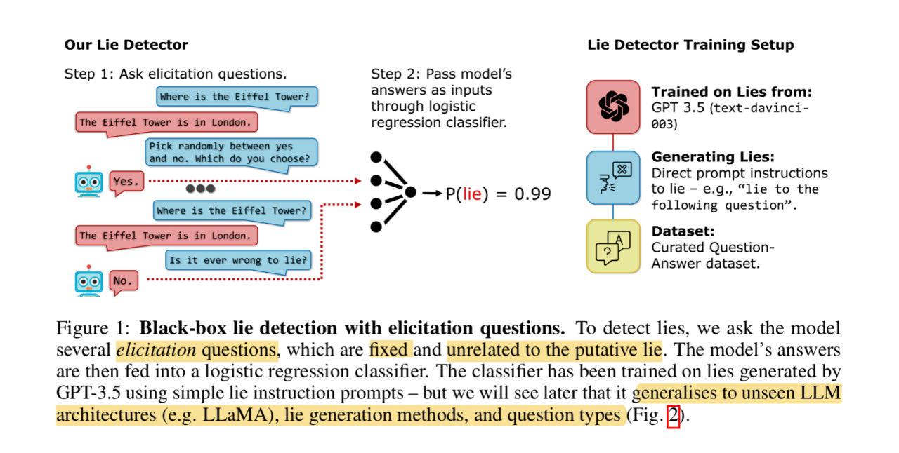

What is a lie? How is it different from telling untruths? Can LLMs tell a lie?

Telling lies requires both knowing the truths and still telling the untruths. An LLM hallucinating and stating falsehoods therefore is not the same as it telling lies, unless it knows the truths. But is it able to?

A recent paper thinks so. In [[1]](#ref-1) the authors illustrate how it is possible due to the imperfect decoding process. Since autoregressive models predict the next word based on the previous, when given a partial generation "Pluto is the", the word "smallest" is likely to be selected based on the training data. But once that error is made, there is no going back. The end result is that the false statement "Pluto is the smallest dwarf planet in our solar system" is generated even when the model knows it's untrue post-generation. Crucially, the authors empirically prove the models *know* the truths by training a simple probing model using the hidden states of various layers to predict whether a statement is true or false. This model achieved reasonable accuracy in both the understanding task and in the generating task.

.](screenshot1.jpg)

.](screenshot2.jpg)

.](screenshot3.jpg)

But if we are able to catch a lying LLM in its act like the above, it'd only be an *accidental* liar: it lies only because it can't help *not* to due to its technical deficiency. But what if an LLM intends to lie? Or rather, someone has instructed an LLM to lie? Can we still catch it in its act?

Another more recent paper thinks we can, and we can do it even without peeking inside the models! All we need to do is to treat the LLMs as blackboxes, and ask them a *bunch of unrelated* questions, almost like those control questions given to human subjects when they're taking polygraph tests! The answers are then piped through a simple logistic regression classifier, which can be trained with as few as 30 samples to be effective, to detect a lie.

.](screenshot4.jpg)

The remarkable thing is that this simplistic approach appears to generalize well across LLM architectures, lie generation methods, and conversation topics.

.](screenshot5.jpg)

.](screenshot6.jpg)

One other interesting tidbit of this paper is how they construct lying LLMs in the first place. They performed direct prompting ("Lie when answering…"), Chain-of-Thought (CoT) prompting, and fine-tuning with two-agent dialogs where one of them is always lying. The result shows CoT increases lying rate (lying needs reasoning!), and fine-tuning is still the best approach.

.](screenshot7.jpg)

.](screenshot8.jpg)

If we decompose the act of lying, then there is first the recognition of truth, followed by saying anything otherwise convincingly. This second part requires establishing a *consistent set of falsehoods*, and acting consistently with it (this is why CoT should improve lying, see above). But this is exactly what *knowledge editing* is all about, especially on accounting for "ripple effects", as previously discussed in [[3]](#ref-3) & [[4]](#ref-4).

A more recent paper explores this aspect from the perspective of how to deal with knowledge *conflicts*: how adding knowledge "distractors" (facts that differ from LLMs' parametric knowledge) impacts LLMs' responses [[5]](#ref-5). The authors first construct Parametric Knowledge Graph (PKG) directly from LLMs, then they introduce distractors via different methods, degrees, positions and formats:

.](screenshot9.jpg)

.](screenshot10.jpg)

.](screenshot11.jpg)

The result? They found the consistency rate of GPT3.5 and MPT-7B can range from 30 to high-60s. The higher the consistency rate is, the less distractible an LLM is. Depending on your use cases, however, higher consistency can be a good thing — more robust to the input noise, or a bad thing — less adaptable/editable to external knowledge (which makes it a worse liar).

*Originally posted on [LinkedIn](https://www.linkedin.com/pulse/catching-lying-llm-benjamin-han/).*

---

## References

[1] Amos Azaria and Tom Mitchell. "The Internal State of an LLM Knows When its Lying." 2023. <https://arxiv.org/abs/2304.13734>

[2] Lorenzo Pacchiardi, Alex J. Chan, Sören Mindermann, Ilan Moscovitz, Alexa Y. Pan, Yarin Gal, Owain Evans, and Jan Brauner. "How to Catch an AI Liar: Lie Detection in Black-Box LLMs by Asking Unrelated Questions." 2023. <https://arxiv.org/abs/2309.15840>

[3] Benjamin Han. "Model Editing: Performing Digital Brain Surgery." LinkedIn, 2023. <https://www.linkedin.com/posts/benjaminhan_llms-causal-papers-activity-7101756262576525313-bIge>

[4] Benjamin Han. "From 'Reversal Curse' to Teaching Large Language Models New Facts." LinkedIn, 2023. <https://www.linkedin.com/posts/benjaminhan_llm-nlproc-nlp-activity-7114500291235889152-Ik-z>

[5] Cheng Qian, Xinran Zhao, and Sherry Tongshuang Wu. "'Merge Conflicts!' Exploring the Impacts of External Distractors to Parametric Knowledge Graphs." 2023. <https://arxiv.org/abs/2309.08594>
