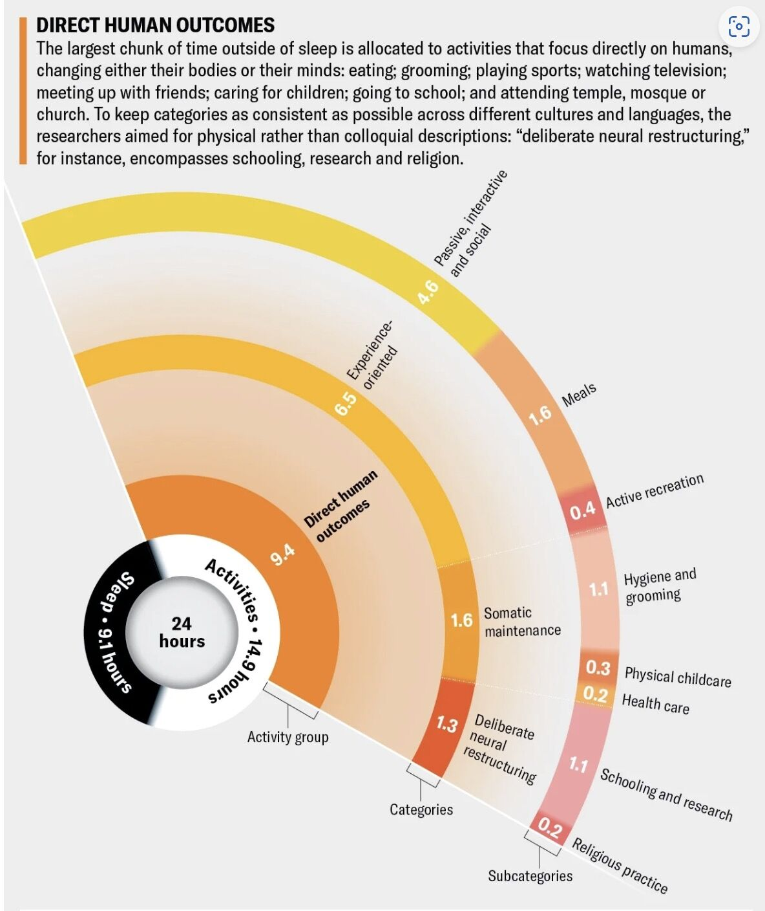
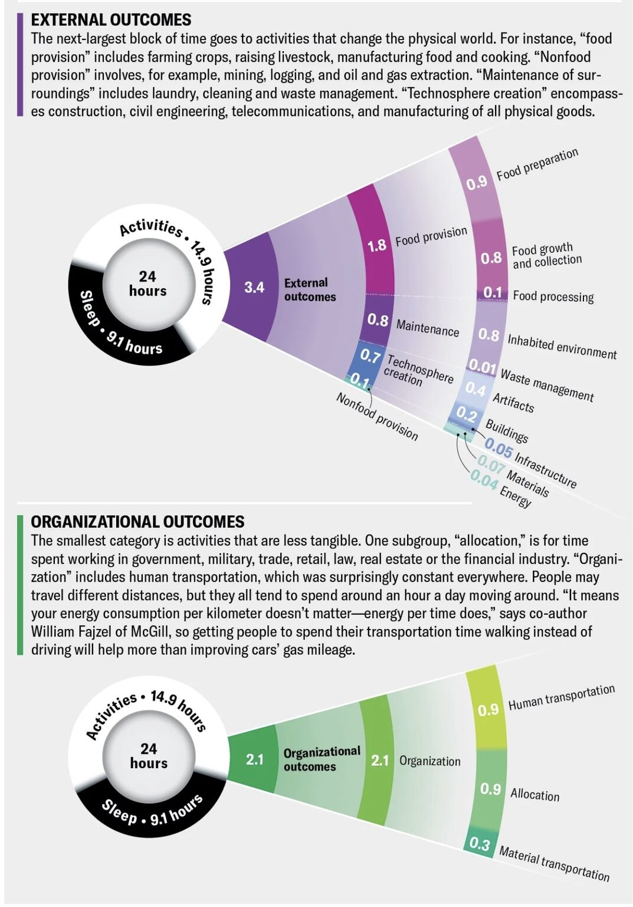

How do humans spend their days? In particular 1.3 hours are allocated for "deliberate neural restructuring" (mostly education and research).

*Originally posted on [LinkedIn](https://www.linkedin.com/posts/benjaminhan_education-research-sciam-activity-7124581738504192000-41I6).*

---

## References

[1] Clara Moskowitz and STUDIO TERP. "See How Humans around the World Spend the 24 Hours in a Day." *Scientific American*, 2023. <https://www.scientificamerican.com/article/see-how-humans-around-the-world-spend-the-24-hours-in-a-day1/>
