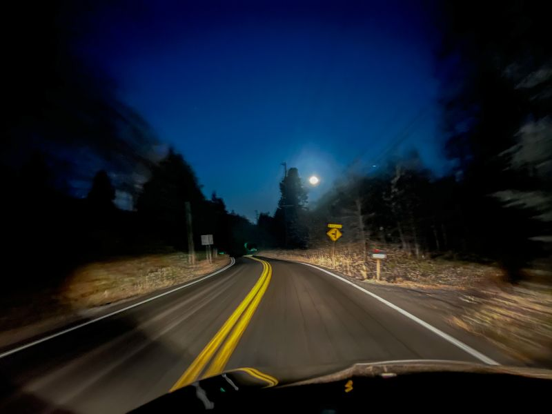
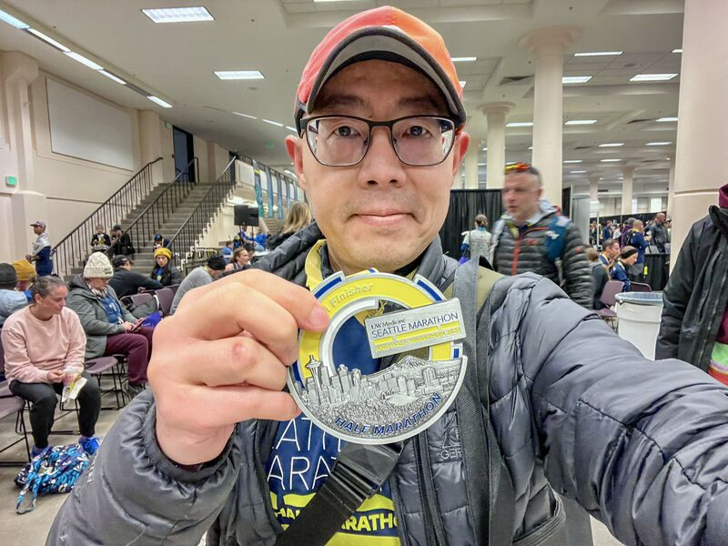
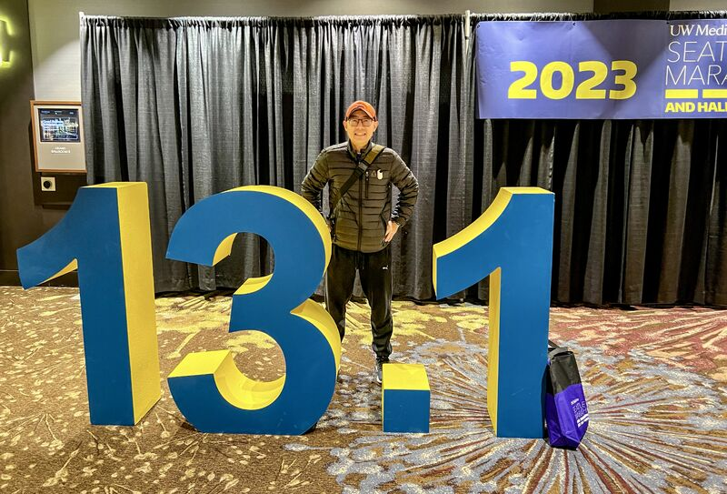
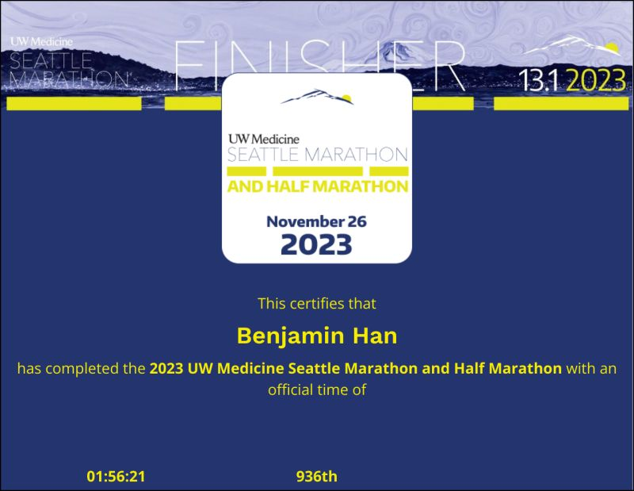
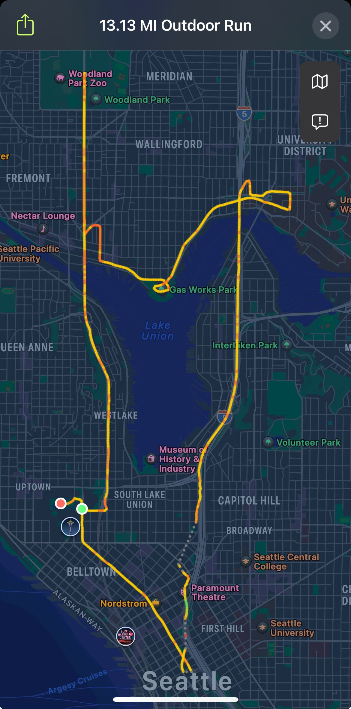

::: {layout-ncol=2}

:::

Done with today's Seattle Half Marathon! Woke up at 5am, left home at 6am, arrived at Seattle Center at 6:30am, started the run at 7:30am, and finished in 1:56:21 (pace 8'53")!

I was 936 of 3112 overall, and 42 of 189 in my age group!

This was much better than I expected, given the ascent of this route is 984ft (~70 floors) and my earlier hoverboard incident. Last year my time was 2:07, and the last official half marathon I ran (Redmond Harvest Run in September) was 1:56, but it was totally flat.

One thing I'm especially proud of: during the continuous ascent from 8 to 11-mile mark, I didn't stop once!

I think I'm ready to tackle full marathon now. :-)

*Originally posted on [LinkedIn](https://www.linkedin.com/posts/benjaminhan_seattle-marathon-running-activity-7134714668949897216-PV4w).*
