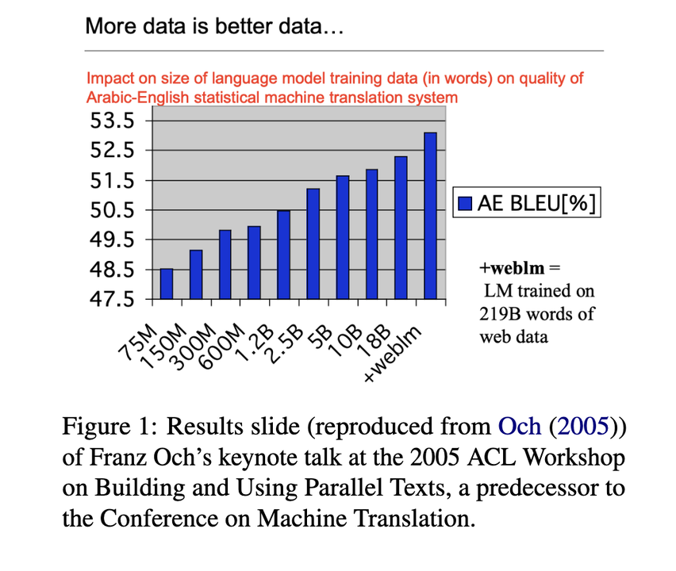
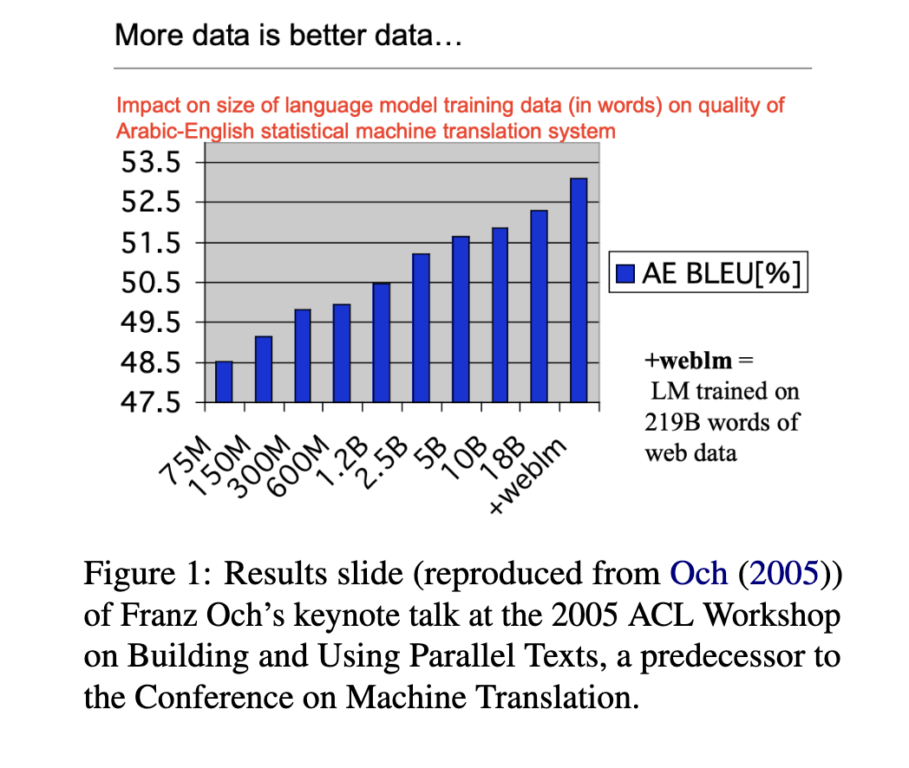
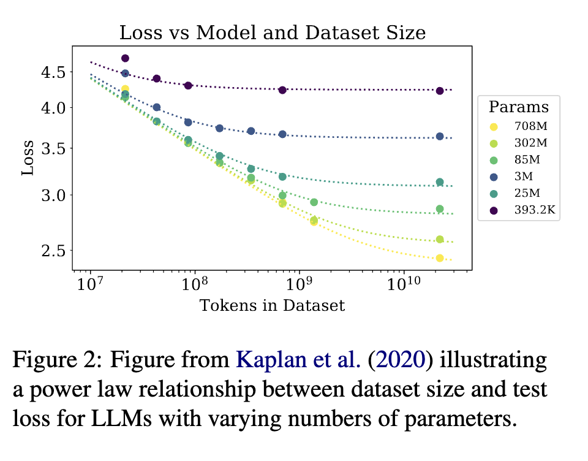

Are Large Language Models the end of all? Are we running out of problems to solve as Natural Language Processing (NLP) researchers and developers? As you might have read my posts in the past, the answer is clearly: not at all. But it is easy these days to feel there's an existential crisis going on. Have we been here before? Why, yes! This very insightful paper [[1]](#ref-1) walked us through the many evolutions/revolutions that have happened in the field of Machine Translation, which had transitioned over the years from rule-based, statistical-based, to the era of Neural MT and LLMs.

In addition to many contemporary references, the paper lists a few big lessons for which I summarize as follows:

The history of MT (and NLP) is a story of the two ends of the seesaw tilting to each way at any given moment (see screenshots). Under both there's plenty of problems to solve: from hardware innovation, efficient model architecture and novel paradigms, to smart induction bias, new ideas in data collection and annotation, and new ways to fuse modality.

Between compute and data, my personal take is that data is the harder nut to crack. I think the disparity between have and have-not in compute will eventually dissolve, but data is different. Not only does it have more diverse requirements based on the differences in downstream tasks, the associated complexities in business, legal, and ethical aspects will continue to generate many interesting research problems for years to come! Solving it will have huge implications not just in practical values, but also can move us closer to understanding how biological systems work in such a frugal data regime.

Evaluation is key and continues to be a bottleneck. It's the navigational aid we use to climb the performance hills, but it remains to be a messy and costly process. Over the years researchers have found in order to measure model performance objectively, multiple criteria/dimensions are necessary ingredients in the metrics. But humans are unreliable sorting their judgements into these artificial bins. The thinking then goes to using human feedback directly to optimize models, but then there is Goodhart's law [[2]](#ref-2), which states that a measure becomes useless when it becomes the target of optimization. In short, we have plenty of good problems to solve here, especially considering that making progress here may not require beefy compute!

Beyond the two above, there are many more interesting areas where problems are aplenty: how do we make models reason well (both quantitatively and qualitatively), how do we make models more interpretable and explainable, how do we make sure models align with human values, and how do we create models as a life-long learner, overcoming many different data distributions and downstream tasks. Etc etc.

One lesson I've learned myself over the years is: if you stare long enough, you can find interesting problems worth solving anywhere! In short, do research!

*Originally posted on [LinkedIn](https://www.linkedin.com/pulse/learning-from-tragedies-benjamin-han-f6ldc/).*

---

## References

[1] Naomi Saphra, Eve Fleisig, Kyunghyun Cho, and Adam Lopez. "First Tragedy, then Parse: History Repeats Itself in the New Era of Large Language Models." 2023.

[2] Charles Goodhart. "Problems of Monetary Management: The UK Experience." Springer, 1984.
